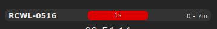
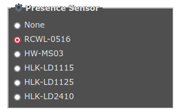
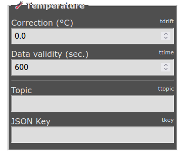
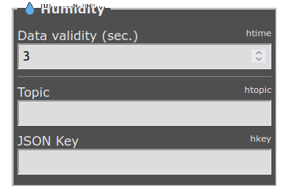
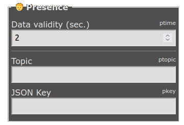
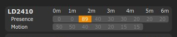
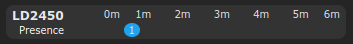
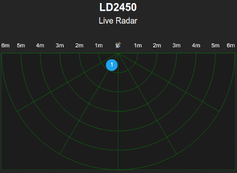

You'll find here all the common libraries and files used by the Tasmota projects of this repository.

## xdrv_94_ip_address.ino ##

This simple driver allows graphical configuration of fixed IP.

## xsns_120_timezone.ino ##

This simple driver allows graphical configuration of Timezone and NTP server.

## xsns_99_generic_sensor.ino ##

This generic sensor allows fews things around sensor management :
  * standard function to read temperature, humidity and presence (not depending on sensor type)
  * declaration and use of remote temperature, humidity and presence sensors
  * presence sensor reading based on timeout
  * visualisation of local presence sensor on main page

To get all available function, just type **sensor_help** in console.

Handled local sensor are :
  * Temperature DHT11, AM2301, SI7021, SHT30 or DS18x20
  * Humidity DHT11, AM2301, SI7021 or SHT30
  * Movement detector RCWL-0516 or HW-MS03 (declared as Counter 1)
  * Presence detector HLK-LD1115H, HLK-LD1125H, HLK-LD2410 or HLK-LD2450

Remote sensor configuration can be done graphically.

 

## xsns_102_ld2410.ino ##

Driver for HLK-LD2410 presence & movement detector.

Please note that this driver is different than the one in official Tasmota repository.

To get the sensor operational :
  - Connect **Tx** to **Rx** and set **Rx** as **LD2410-Rx**
  - Connect **Rx** to **Tx** and set **Tx** as **LD2410-Tx**
  - Select **LD2410** in **Sensor** configuration 

To get all available function, just type **ld2410_help** in console.

## xsns_102_ld2450.ino ##

Driver for HLK-LD2450 presence radar detector.

To get the sensor operational :
  - Connect **Tx** to **Rx** and set **Rx** as **LD2410-Rx**
  - Connect **Rx** to **Tx** and set **Tx** as **LD2410-Tx**
  - Select **LD2450** in **Sensor** configuration
  - 
To get all available function, just type **ld2450_help** in console.

You can get a realtime radar view of targets detected :

## xdrv_40_telegram_extension.ino ##

This is an extension of **xdrv_40_telegram.ino** to allow :
 - markdown syntax
 - HTML syntax
 - conversion from \n to telegram LF
 - disabling of web link preview
 - disabling of message notification
 - message update
 - message reply

## xdrv_50_filesystem_cfg_csv.ino ##

This exension provides few functions to ease the use of **.ini** configuration files and **.csv** database files.

It provides functions to :
  - Load value from a key in an **INI** file (string, int, float and long long)
  - Save value to a key in an **INI** file (string, int, float and long long)
  - Navigate from line to line in a **CSV** file (normal or reverse)
  - Extract specific column in a **CSV** line
  - File rotate based on provided naming scheme 
 
## xdrv_93_filesystem_log.ino ##

It provides functions to manage a structured event log file :
  - Append data in an existing logged event
  - Generate HTML display from an event log file
  
## Others ##

Common files are :

  * **xdrv_96_ftp_server.ino** : Embedded FTP Server
  * **xdrv_97_tcp_server.ino** : Embedded TCP server for Teleinfo stream
  * **xdrv_98_esp32_board.ino** : Handler for ESP32 Ethernet board configuration
  * **xsns_121_hlk_ld1125.ino** : Driver for HLK-LD1125 presence & movement detector
  * **xsns_122_hlk_ld1115.ino** : Driver for HLK-LD1115 presence & movement detector

External libraries are :

  * **FTPClientServer.zip** : Embedded Simple FTP server for ESP8266 and ESP32.

  * **ArduinoJson.zip** : Arduino JSON management library. You can also retrieve latest ArduinoJson library thru git.

          # cd your-project/lib/default
          # git clone https://github.com/bblanchon/ArduinoJson.git

