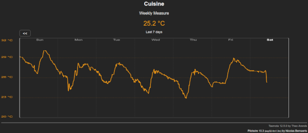
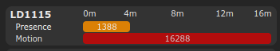

You'll find here all the common libraries and files used by the Tasmota projects of this repository.

## Timezone management ##

File : **xsns_120_timezone.ino**

This simple driver allows graphical configuration of Timezone and NTP server.

## Generic sensor driver ##

File : **xsns_99_generic_sensor.ino**

This generic sensor drivers allows to :
  - standardize access to local and remote sensors (temperature, humidity and presence)
  - historisation of weekly and yearly measures
  - use of MQTT remote sensors

To get all available function, just type **sensor_help** in console.

 Local sensor can be :
  * Temperature : DHT11, AM2301, SI7021, SHT30 or DS18x20
  * Humidity : DHT11, AM2301, SI7021 or SHT30
  * Movement : RCWL-0516 or HW-MS03 (declared as Counter 1)
  * Presence : HLK-LD1115, HLK-LD1125, HLK-LD2410 or HLK-LD2450

If enabled, weekly and/or yearly data can be recorded.

## HLK LD1115 presence & movement detector ##

File : **xsns_122_ld1115.ino**

Driver for HLK-LD1115 presence & movement detector.

To get the sensor operational :
  - Connect **Rx** and **Tx**
  - Configure **LD2410-Rx** and **LD2410-Tx**
  - Select **LD1115** in **Sensor** configuration 

To get all available function, just type **ld1115_help** in console.

## HLK LD1125 presence & movement detector ##

File : **xsns_121_ld1125.ino**

Driver for HLK-LD1125 presence & movement detector.

To get the sensor operational :
  - Connect **Rx** and **Tx**
  - Configure **LD2410-Rx** and **LD2410-Tx**
  - Select **LD1125** in **Sensor** configuration 

To get all available function, just type **ld1125_help** in console.

## HLK LD2410 presence detector ##

File : **xsns_102_ld2410.ino**

Driver for HLK-LD2410 presence & movement detector.

Please note that this driver is different than the one in official Tasmota repository.

To get the sensor operational :
  - Connect **Rx** and **Tx**
  - Configure **LD2410-Rx** and **LD2410-Tx**
  - Select **LD2410** in **Sensor** configuration 

To get all available function, just type **ld2410_help** in console.

## HLK LD2450 presence detector ##

File : **xsns_102_ld2450.ino**

Driver for HLK-LD2450 presence radar detector.

To get the sensor operational :
  - Connect **Rx** and **Tx**
  - Configure **LD2410-Rx** and **LD2410-Tx**
  - Select **LD2450** in **Sensor** configuration

To get all available function, just type **ld2450_help** in console.

You can get a realtime radar view of targets detected :

## Telegram driver extension ##

File : **xdrv_40_telegram_extension.ino**

This is an extension of **xdrv_40_telegram.ino** to allow :
 - markdown syntax
 - HTML syntax
 - conversion from \n to telegram LF
 - disabling of web link preview
 - disabling of message notification
 - message update
 - message reply
 
## Others ##

Some other drivers are available from this repository :
  **xdrv_94_ip_address.ino** : Simple driver to allow graphical configuration of IP and misc options
  * **xdrv_96_ftp_server.ino** : Embedded FTP Server
  * **xdrv_97_tcp_server.ino** : Embedded TCP server for Teleinfo stream
  * **xdrv_98_esp32_board.ino** : Handler for ESP32 Ethernet board configuration

You'll also find some external libraries used by the drivers :

  * **FTPClientServer.zip** : Embedded Simple FTP server for ESP8266 and ESP32.

  * **ArduinoJson.zip** : Arduino JSON management library. You can also retrieve latest ArduinoJson library thru git.

          # cd your-project/lib/default
          # git clone https://github.com/bblanchon/ArduinoJson.git

