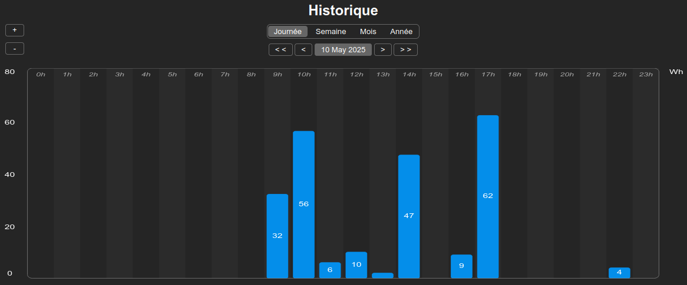
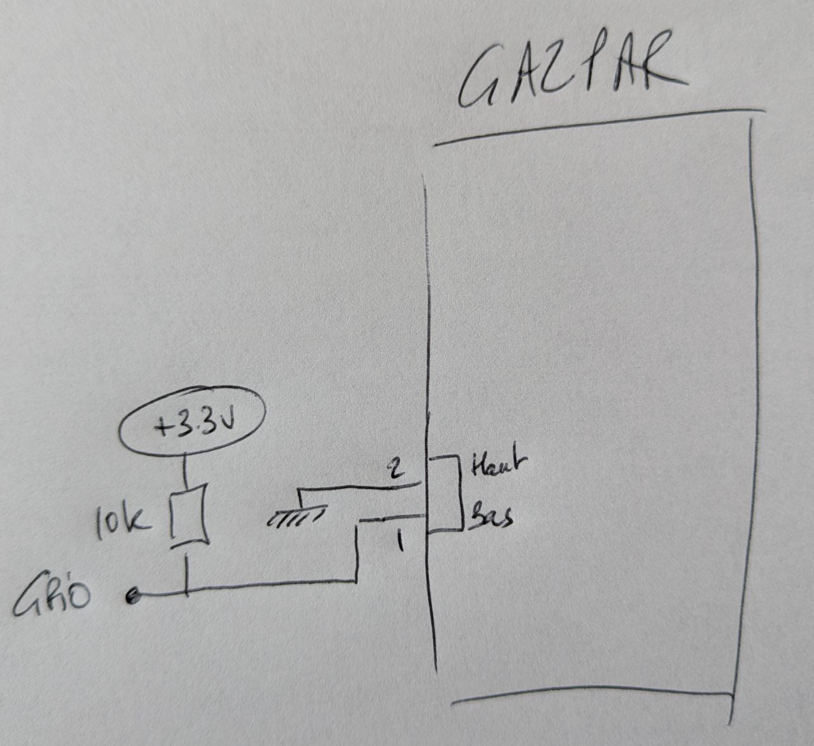

Gazpar Tasmota firmware
=============

Presentation
------------

Cette évolution du firmware **Tasmota 14.6.0** intègre la gestion des compteurs de gaz intelligents **Gazpar**.

Elle est compatible avec les **ESP8266** et **ESP32**.
 
Ce firmware utilise la partition **LittleFS** pour stocker les historiques de consommation et les restituer sous forme de graphiques de consommation.

Pour garantir un partitionnement correct, veillez à flasher une première fois l'ESP en mode série. Une fois cette opération réalisée, les mises à jour pourront se faire via l'interface Web.

Des fimrwares précompilés sont disponibles dans le répertoire  [**binary**](https://github.com/NicolasBernaerts/tasmota/tree/master/gazpar/binary).

Connexion
-------------

Gazpar propose un connecteur collecteur ouvert.

Voici un schéma simplifié de connection entre le compteur et une GPIO de votre ESP :

Le connecteur GPIO concerné doit être déclaré en **INPUT 1**.

Evitez GPIO16 qui n'est pas compatible avec la gestion des interruptions matérielles utilisée par ce firmware.

Compilation
-----------

Si vous voulez compiler ce firmware vous-même, vous devez :
1. installer les sources **tasmota** officielles (utilisez la même version que celle déclarée en tête de cette page
2. déposez ou remplacez les fichiers de ce **repository**
3. déposez ou remplacez les fichiers du repository **tasmota/common**

Voici la liste exhaustive des fichiers concernés :

| File    |  Comment  |
| --- | --- |
| **platformio_override.ini** |    |
| partition/**esp32_partition_4M_app1800k_fs1200k.csv** | Safeboot partitioning to get 1.3Mb FS on 4Mb ESP32   |
| boards/**esp8266_4M2M.json** | ESP8266 4Mb boards  |
| boards/**esp8266_16M14M.json** | ESP8266 16Mb boards  |
| boards/**esp32_4M1200k.json** | ESP32 4Mb boards  |
| tasmota/**user_config_override.h**  |    |
| tasmota/include/**tasmota_template.h**  | Allow INPUT on Esp8266   |
| tasmota/tasmota_drv_driver/**xdrv_01_9_webserver.ino** | Add compilation target in footer  |
| tasmota/tasmota_drv_driver/**xdrv_94_ip_option.ino** | Fixed IP adn other option web configuration |
| tasmota/tasmota_drv_driver/**xdrv_110_gazpar.ino** | Gazpar driver |
| tasmota/tasmota_drv_energy/**xdrv_112_gazpar_domoticz.ino** | Gazpar Domoticz integration  |
| tasmota/tasmota_drv_energy/**xdrv_113_gazpar_hass.ino** | Gazpar Home Assistant integration  |
| tasmota/tasmota_drv_energy/**xdrv_114_gazpar_homie.ino** | Gazpar Homie protocol integration  |
| tasmota/tasmota_sns_sensor/**xsns_99_timezone.ino** | Timezone Web configuration |

If everything goes fine, you should be able to compile your own build.
