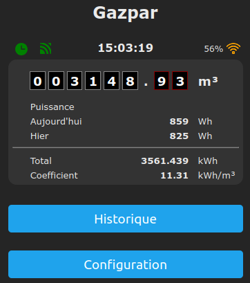

Gazpar Tasmota firmware
=============

Presentation
------------

This evolution of **Tasmota 14.6.0** firmware has been enhanced to handle France gaz meters known as **Gazpar** using a dry contact counter.

It is compatible with **ESP8266** and **ESP32** chipsets.
 
This firmware uses LittleFS partition to store graph data. Il allows to keep historical data over reboots.
To take advantage of this feature, make sure to follow partitioning procedure given in the **readme** of the **binary** folder.

This firmware provides some extra Web page on the device :
  * **/graph** : yearly, monthly and daily graphs

Pre-compiled versions are available in the [**binary**](https://github.com/NicolasBernaerts/tasmota/tree/master/gazpar/binary) folder.

Configuration
-------------

Gazpar impulse should be declared as **Input 1**

Compilation
-----------

Si vous voulez compiler ce firmware vous-même, vous devez :
1. installer les sources **tasmota** officielles (utilisez la même version que celle déclarée en tête de cette page
2. déposez ou remplacez les fichiers de ce **repository**
3. déposez ou remplacez les fichiers du repository **tasmota/common**

Voici la liste exhaustive des fichiers concernés :

| File    |  Comment  |
| --- | --- |
| **platformio_override.ini** |    |
| partition/**esp32_partition_4M_app1800k_fs1200k.csv** | Safeboot partitioning to get 1.3Mb FS on 4Mb ESP32   |
| boards/**esp8266_4M2M.json** | ESP8266 4Mb boards  |
| boards/**esp8266_16M14M.json** | ESP8266 16Mb boards  |
| boards/**esp32_4M1200k.json** | ESP32 4Mb boards  |
| tasmota/**user_config_override.h**  |    |
| tasmota/tasmota_drv_driver/**xdrv_01_9_webserver.ino** | Add compilation target in footer  |
| tasmota/tasmota_drv_driver/**xdrv_94_ip_address.ino** | Fixed IP address Web configuration |
| tasmota/tasmota_drv_driver/**xdrv_96_gazpar.ino** | Gazpar driver |
| tasmota/tasmota_drv_energy/**xdrv_98_integration_hass.ino** | Gazpar home assistant integration  |
| tasmota/tasmota_drv_energy/**xdrv_99_integration_homie.ino** | Gazpar homie protocol integration  |
| tasmota/tasmota_sns_sensor/**xsns_99_timezone.ino** | Timezone Web configuration |

If everything goes fine, you should be able to compile your own build.

Screen shots
------------

 
 
 
