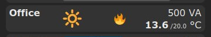
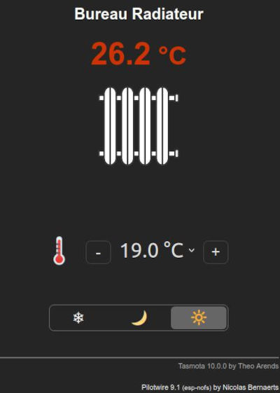
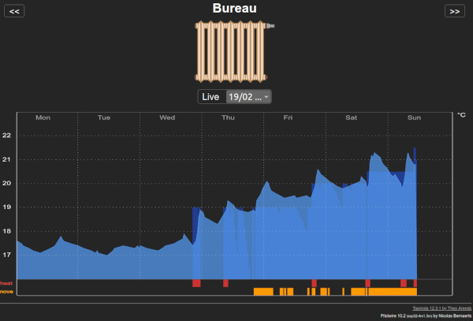
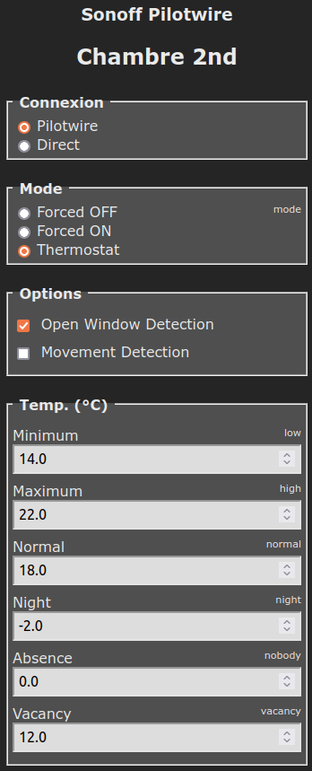

# Offload & Pilotwire Tasmota firmware #

These 2 firmwares are based on Tasmota **v12.3.1**. They have been developped to provide :
* **Offload** capacity based on a MQTT subscription to a global Meter
* **Pilotwire** management for electrical heaters using **Fil Pilote** protocol widely available in France

This firmare provides :
  * Web configuration interface
  * extension of JSON MQTT status
  * new specific MQTT commands
  * automatic offload when global power is overloading your contract
  * night mode management (timer ON = go to night mode, timer OFF = go back to normal mode)
  * **/control** public page to control the device
  * **/log** public page to get offloading history

## Offload ##

**Offload** firmware provides an offload capability based on :
  * the device power
  * your actual global consumption
  * your contact maximum power

If global power exceed your contract level, device is offloaded as long as your global consumption has not dropped enougth.

It allows to cut devices like geaser, ... before your house meter strips because of over-power.

It has been tested on **Sonoff S26**, **Sonoff Pow R2**, **Athom power plug** and various **ESP32** boards.

### Configuration ###

You need to configure usual tasmota stuff, plus the **Offload** section.

Here, you need to configure :
  * The topic where your energy meter data are published
  * The key where to read your contract maximum power (VA)
  * The key xhere to read your global instant power (VA)
  * The power of device controled by your Tasmota
  * Priority of the device in case off offloading (several devices may offload the one after the other)
  
After next restart, offload mecanism will start.

### Console commands ###

Here the console commands provided with this firmware :
  * **ol_help** : list of available commands
  * **ol_power** [value] : device power (VA)
  * **ol_type** [value] : device type (see **ol_help** for the full list)
  * **ol_prio** [value] : device priority (1 max ... 10 min)
  * **ol_max** [value] : contract power (VA)
  * **ol_adj** [+-value] : contract power adjustment (in %, 0 = contract)
  * **ol_topic** [topic] : MQTT topic of the meter
  * **ol_kmax** [key] : MQTT key for contract power
  * **ol_kinst** [key] : MQTT key for current meter instant power
  * **ol_rearm** [value] : Switch rearm delay (0 no rearm or rearm delay in sec.)

### MQTT ###

Offload MQTT JSON result should look like that :

    23:59:26.476 MQT: chambre2nd/tele/STATE = {"Time":"2022-01-19T23:59:26","Offload":{"State":0,"Stage":0,"Device":1500},"TempUnit":"C"}}

## Pilotwire ##

Pilotwire firmware allows to handle an electrical heater using the **fil pilote** french protocol.

It is an extension of previous **Offload** firmware, so that it provides the same offload capabilities described before.

This firmware specifically manages :
  * **thermostat** according to any declared temperature sensor (local or remote)
  * **presence detection** to lower thermostat in case of vacancy
  * **opened window detection** to cut power when window is opened
  * **night mode** to lower temperature at night
  * **ecowatt** signal action to lower thermostat in case of risk of power cut
  * **offload** management

**Pilotwire** has been tested on **Sonoff Basic** (1Mb), **ESP01** (1Mb), **Wemos D1 Mini** (4Mb) and **ESP32** (4Mb).

Pilotwire protocol is described at http://www.radiateur-electrique.org/fil-pilote-radiateur.php
 
### Hardware setup ###

You need to connect a diode between your relay output and the heater's *fil pilote* (usually black color wire).

Typical diode to use is **1N4007**. Connexion should be done directly on the relay output :

### Configuration ###

First you need to configure normal Tasmota stuff and **Offload** section.

Then, if you are using remote MQTT sensors (temperature and/or presence), you may need to configure **Sensor** section.

Then you need to configure **Pilotwire** section. It allows :
  * to select pilotwire protocol or direct plug management
  * to select pilotwire options (open window detection, movement detection and Ecowatt signal)
  * to configure target temperature for different cases

Finally you may configure the **Ecowatt** topic you want to subscribe to. This is done in console mode :

     # eco_topic ecowatt/tele/SENSOR

You can adjust topic to your environment.

It then allows to adjust target temperature according to Ecowatt signals level 2 (low risk of power cut) and level 3 (high risk of power cut).

#### Night mode ####

Night mode allows to automatically drop temperature at night.

It is configured thru standard Tasmota **timers** :
  * Timer **ON** switch to **comfort** temperature
  * Timer **OFF** switches to **night mode** temperature

#### Open Window detection ####

Open window detection allows to automatically cut the heater when a window is opened and to sxwitch it back on when window is closed.

Its principle is quite simple : 
  * if temperature drops 0.5°C in less than 4mn heater is switched off
  * it is switched back on when temperature increase 0.2°C

Any change in running mode resets the open window detection.

#### Presence detection ####

Presence detection works as follow :

  * Main rules
    * if no movement sensor is present, movement is considered as permanent
    * you can configure an **initial** timeout period in minutes
    * you can configure a **no movement** timeout period in minutes

  * When **Confort Mode** is set :
    * when you set comfort mode, target temperature is set to comfort mode
    * if there is no movement after **initial** timeout, target temperature is set to **eco** mode 
    * as soon as there is a movement detected, target temperature is set to comfort mode
    * if there is no movement after **no movement** timeout, target temperature is set to **eco** mode

  * When **Confort Temperature** is changed :
    * when you change comfort mode target temperature, target temperature is set back to comfort mode
    * if there is no movement after **no movement** timeout, target temperature is set to **eco** mode

### Console commands ###

Here the console commands provided with this firmware :
  * **pw_help** : list of available commands
  * **pw_type** [value] : device type (0 - Pilotwire, 1 - Direct connexion)
  * **pw_mode** [value] : heater running mode (0 - Off, 1 - Economie, 2 - Nuit, 3 - Confort, 4 - Forcé)
  * **pw_target** [value] : target temperature (°C)
  * **pw_ecowatt** [0/1] : disable/enable ecowatt management
  * **pw_window** [0/1] : disable/enable open window detection
  * **pw_presence** [0/1] : disable/enable presence detection
  * **pw_low** [value] : lowest acceptable temperature (°C)
  * **pw_high** [value] : highest acceptable temperature (°C)
  * **pw_comfort** [value] : default comfort temperature (°C)
  * **pw_nofrost** [value] : no frost temperature (delta with comfort if negative)
  * **pw_eco** [value] : eco temperature (delta with comfort if negative)
  * **pw_night** [value] : night temperature (delta with comfort if negative)
  * **pw_eco2** [value] : ecowatt level 2 temperature (delta with comfort if negative)
  * **pw_eco3** [value] : ecowatt level 3 temperature (delta with comfort if negative)
  * **pw_initial** [value] : presence detection timeout when changing running mode (mn)
  * **pw_normal** [value] : presence detection timeout after detection (mn)

### MQTT ###

Pilotwire MQTT JSON result should look like that :

    23:59:26.476 MQT: chambre2nd/tele/STATE = {"Time":"2022-01-19T23:59:26","Pilotwire":{"Mode":2,"Status":2,"Heating":1,"Temperature":16.9,"Target":17.0,"Detect":128,"Window":0},"Offload":{"State":0,"Stage":0,"Device":1500},"TempUnit":"C"}}

### Compilation ###

Pre-compiled version of Tasmota handling **offload** and **fil pilote** are available in the **bin** directory.

If you want to compile this firmware version, you just need to :
1. install official tasmota sources
2. place or replace files from this repository
3. place specific files from **tasmota/common** repository

Here is where you should place different files from this repository and from **tasmota/common** :
* **platformio_override.ini**
* lib/default/**ArduinoJson**
* tasmota/**user_config_override.h**
* tasmota/include/**tasmota.h**
* tasmota/tasmota_drv_driver/**xdrv_01_9_webserver.ino**
* tasmota/tasmota_drv_driver/**xdrv_50_filesystem_cfg_csv.ino**
* tasmota/tasmota_drv_driver/**xdrv_93_filesystem_log.ino**
* tasmota/tasmota_drv_driver/**xdrv_94_ip_address.ino**
* tasmota/tasmota_drv_driver/**xdrv_96_offload.ino**
* tasmota/tasmota_drv_driver/**xdrv_97_ecowatt_client.ino**
* tasmota/tasmota_sns_sensor/**xsns_120_timezone.ino**
* tasmota/tasmota_sns_sensor/**xsns_125_generic_sensor.ino**
* tasmota/tasmota_sns_sensor/**xsns_126_pilotwire.ino**

If needed, you can also add specific presence sensor drivers :

* tasmota/tasmota_sns_sensor/**xsns_102_ld2410.ino**
* tasmota/tasmota_sns_sensor/**xsns_121_ld1125.ino**
* tasmota/tasmota_sns_sensor/**xsns_122_ld1115.ino**

If everything goes fine, you should be able to compile your own build.

### Screen shot ###

#### Control and Graph ####

#### Config ####

 
 

