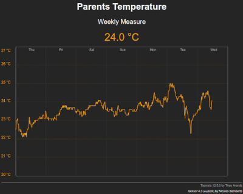
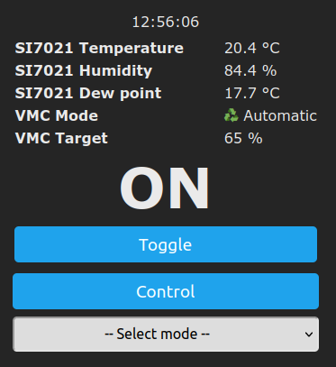
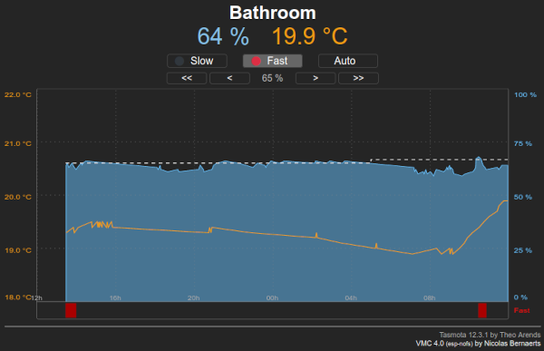

Tasmota firmware extension for Sensors & VMC control
=============

This evolution of Tasmota firmware is bsed on **Tasmota v12.5.0** and has been enhanced to handle :
  * some generic sensors with history
  * a Motor Controled Ventilator according to current humidity level

Sensors
-------
According to the type of sensor you've connected to your Tasmota (temperature, humidity, presence, ...) you'll be able to keep history of the sensors activity.

2 activity periods are handled :
  * weekly
  * yearly

This history can be saved in 2 different locations :
  * String Settings
  * CSV files (if LittleFS is available)

As String Settings capacity is quite limited, you may not be able to save any type of history.

Here are the commands available to handle sensors history :

    HLP: Sensor commands :
     - sens_init <w/y>    = reset data (w:current week, y:current year)
     - sens_rand <w/y>    = random data (w:current week, y:current year)
    Temperature :
      - temp_topic <topic> = topic of remote sensor
      - temp_key <key>     = key of remote sensor
      - temp_drift <value> = correction (in 1/10 of °C)
      - temp_time <value>  = remote sensor timeout
      - temp_week <0/1>    = weekly histo. (86 bytes)
      - temp_year <0/1>    = yearly histo. (126 bytes)
    Humidity :
      - humi_topic <topic> = topic of remote sensor
      - humi_key <key>     = key of remote sensor
      - humi_time <value>  = remote sensor timeout
      - humi_week <0/1>    = weekly histo. (85 bytes)
    Presence :
      - pres_topic <topic> = topic of remote sensor
      - pres_key <key>     = key of remote sensor
      - pres_time <value>  = sensor timeout
      - pres_week <0/1>    = weekly histo. (48 bytes)
      - pres_year <0/1>    = yearly histo. (54 bytes)
    Activity :
      - acti_week <0/1>    = weekly histo. of activity (48 bytes)
      - inac_week <0/1>    = weekly histo. of inactivity (48 bytes)

 

VMC
----
In **Auto** mode, VMC is :
  * started as soon as humidity goes beyond a target value
  * stopped as soon as humidity goes below this target value.

Humidity sensor can either be :
  * a local SI7021 sensor
  * a local SHT30 sensor
  * a remote MQTT humidity sensor
  
You'll get some extra Web pages on the device :
  * **/control** : page to control operating mode and with a 24h humidity/temperature graph
  * **/info.json** : Main device characteristics in JSON format

MQTT result should look like that :

    {"Time":"2020-05-16T17:11:55","SI7021":{"Temperature":22.2,"Humidity":72.4},"Timezone":{"STD":{"Offset":60,"Month":10,"Week":0,"Day":1},"DST":{"Offset":120,"Month":3,"Week":0,"Day":1}},"VMC":{"Relay":1,"Mode":3,"Label":"Automatic","Temperature":22.2,"Humidity":72.4,"Target":60,"Threshold":2},"State":{"Mode":2,"Label":"High speed"},"Humidity":{"State":nan,"Topic":"","Key":""},"TempUnit":"C"}    {"VMC":{"Relay":1,"Mode":3,"Label":"Automatic","Temperature":22.2,"Humidity":71.5,"Target":60,"Threshold":2},"State":{"Mode":2,"Label":"High speed"},"Humidity":{"State":nan,"Topic":"","Key":""}}
    {"VMC":{"Relay":1,"Mode":3,"Label":"Automatic","Temperature":22.2,"Humidity":71.6,"Target":60,"Threshold":2},"State":{"Mode":2,"Label":"High speed"},"Humidity":{"State":nan,"Topic":"","Key":""}}
    {"VMC":{"Relay":1,"Mode":3,"Label":"Automatic","Temperature":22.2,"Humidity":71.7,"Target":60,"Threshold":2},"State":{"Mode":2,"Label":"High speed"},"Humidity":{"State":nan,"Topic":"","Key":""}}
    {"VMC":{"Relay":1,"Mode":3,"Label":"Automatic","Temperature":22.2,"Humidity":71.8,"Target":60,"Threshold":2},"State":{"Mode":2,"Label":"High speed"},"Humidity":{"State":nan,"Topic":"","Key":""}}

Compilation
-----------

If you want to compile this firmware version, you just need to :
1. install official tasmota sources
2. place or replace files from this repository
3. place specific files from **tasmota/common** repository

Here is where you should place different files from this repository and from **tasmota/common** :
* **platformio_override.ini**
* tasmota/**user_config_override.h**
* tasmota/include/**tasmota.h**
* tasmota/tasmota_drv_driver/**xdrv_01_webserver.ino**
* tasmota/tasmota_drv_driver/**xdrv_50_filesystem_cfg_csv.ino**
* tasmota/tasmota_drv_driver/**xdrv_94_ip_address.ino**
* tasmota/tasmota_drv_driver/**xdrv_98_vmc.ino**
* tasmota/tasmota_sns_sensor/**xsns_121_vmc.ino**
* tasmota/tasmota_sns_sensor/**xsns_120_timezone.ino**
* tasmota/tasmota_sns_sensor/**xsns_99_generic_sensor.ino**

If everything goes fine, you should be able to compile your own build.

   
