# Firmware Tasmota Teleinfo

⚠️ Depuis la **version 13**, le partitionnement a évolué pour la famille des **ESP32**. Il utilise maintenant le partitionnement standard **safeboot**. Si vous faites une mise à jour ESP32 depuis une version plus ancienne, Vous devez faire un flash **serial**. Si vous faites une mise à jour **OTA** vous pourrez rencontrer des dysfonctionnements.

A partir du moment où vous disposez d'une version **13++**, vous pouvez bien entendu réaliser les mises à jour en mode **OTA**. Le partitionnement des **ESP8266** n'a pas changé.

## Presentation

Cette évolution du firmware **Tasmota 13.4.0** permet de :
  * gérer le flux **TIC** des compteurs français (**Linky**, **PME/PMI** et **Emeraude**)
  * s'abonner aux API RTE **Tempo**, **Pointe** et **Ecowatt**
  * publier les données sous **Domoticz**
  * publier les données sous **Home Assistant**

Ce firmware a été développé et testé sur les compteurs suivants :
  * **Sagem Classic monophase** en TIC **Historique**
  * **Linky monophase** en TIC **Historique** & **Standard**
  * **Linky triphase** en TIC **Historique** & **Standard**
  * **Ace6000 triphase** en TIC **PME/PMI**
  * **Emeraude** en TIC **Emeraude 2 quadrands**

La réception **TIC** intègre une correction d'erreur basée sur le checksum afin de ne traiter que des données fiables.

Il a été compilé et testé sur les ESP suivants :
  * **ESP8266** 1Mb, 4Mb et 16Mb
  * **ESP32** 4Mb et **ESP32 Denky D4** 8Mb
  * **ESP32C3** 4Mb
  * **ESP32C6 Winky** 4Mb (auto-alimenté par le compteur)
  * **ESP32S2** 4Mb
  * **ESP32S3** 4Mb et 16Mb

Ce firmware fournit également :
  * un serveur intégré **TCP** pour diffuser en temps réel les données reçues du compteur
  * un serveur intégré **FTP** pour récupérer les fichiers historiques

Des versions pré-compilées sont disponibles dans le répertoire [**binary**](./binary).

Ce firmware n'est pas le firmware officiel **Teleinfo** de **Tasmota**. C'est une implémentation complètement différente de celle publiée en 2020 par Charles Hallard. 

Il gère les compteurs en mode consommation et production. 

Ce firmware gère les données suivantes :
  * Tension (**V**)
  * Courant (**A**)
  * Puissance instantanée et active (**VA** & **W**)
  * Compteurs de période (**Wh**)
  * Facteur de puissance (**Cosφ**), calculé sur la base du compteur de période et de la puissance instantanée.

Il fournit des pages web spécifiques :
  * **/tic** : suivi en temps réel des données réçues
  * **/graph** : graph en temps réel des données du compteur
  * **/conso** : suivi des consommations
  * **/prod** : suivi de la production
  
Si votre compteur est en mode historique, la tension est forcée à 230V.

Si vous souhaitez supprimer l'affichage des données Energy sur la page d'accueil, vous devez passer la commande suivante en console :

    websensor3 0

Le protocole **Teleinfo** est décrit dans [ce document](https://www.enedis.fr/sites/default/files/Enedis-NOI-CPT_54E.pdf)

## Publication MQTT

En complément de la section officielle **ENERGY**, les sections suivantes peuvent être publiées :
  * **METER** : données de consommation et prodcution en temps réel sous une forme compacte.
  * **ALERT** : alertes publiées dans les messages STGE (changement Tempo / EJP, surpuissance & survoltage)
  * **CONTRACT** : données du contrat intégrant les compteurs de périodes en Wh
  * **CAL** : calendrier consolidé entre le compteur et les données RTE (Tempo, Pointe & Ecowatt)
  * **RELAY** : relais virtuels publiés par le compteur
  * **TIC** : etiquettes et données brutes reçues depuis le compteur

Toutes ces publications sont activables à travers la page **Configuration Teleinfo**.

Voici la liste des données publiées dans la section **METER** :
  * **PH** = nombre de phases (1 ou 3)
  * **PSUB** = puissance apparente (VA) maximale par phase dans le contrat
  * **ISUB** = courant (A) maximal par phase dans le contrat 
  * **PMAX** = puissance apparente (VA) maximale par phase intégrant le pourcentage acceptable
  * **I** = courant instantané (A) global
  * **P** = puissance instantanée (VA) globale
  * **W** = puissance active (W) globale
  * **C** = facteur de puissance (cos φ)
  * **2DAY** = Total consommé aujourd'hui (Wh)
  * **YDAY** = Total consommé hier (Wh)
  * **Ix** = courant instantané (A) sur la phase **x** 
  * **Ux** = tension (V) sur la phase **x** 
  * **Px** = puissance instantanée (VA) sur la phase **x** 
  * **Wx** = puissance active (W) sur la phase **x**
  * **PP** = puissance instantanée (VA) produite
  * **PW** = puissance active (W) produite
  * **PC** = facteur de puissance (cos φ) de la production
  * **P2DAY** = Total produit aujourd'hui (Wh)
  * **PYDAY** = Total produit hier (Wh)

Voici les données publiées dans la section **CAL** :
  * **lv** = niveau de la période actuelle (0 inconnu, 1 bleu, 2 blanc, 3 rouge)
  * **hp** = type de la période courante (0:heure creuse, 1 heure pleine)
  * **today** = section avec le niveau et le type de chaque heure du jour
  * **tomorrow** = section avec le niveau et le type de chaque heure du lendemain

Voici les données publiées dans la section **RELAY** :
  * **R1** = état du relai virtual n°1 (0:ouvert, 1:fermé)
  * **R2** = état du relai virtual n°2 (0:ouvert, 1:fermé)
  * .. 

Voici les données publiées dans la section **ALERT** :
  * **Load** = indicateur de surconsommation (0:pas de pb, 1:surconsommation)
  * **Volt** = indicateur de surtension (0:pas de pb, 1:au moins 1 phase est en surtension)
  * **Preavis** = niveau du prochain préavis (utilisé en Tempo & EJP)
  * **Label** = Libellé du prochain préavis

En complément des données de base du contrat, la section **CONTRAT** liste l'ensemble des périodes dans votre contrat. Seules les périodes avec un total de consommation différent de **0** sont publiées.

## Commands

Ce firmware propose un certain nombre de commandes **EnergyConfig** spécifiques disponibles en mode console :

    EnergyConfig Teleinfo parameters :
      historique      set historique mode at 1200 bauds (needs restart)
      standard        set standard mode at 9600 bauds (needs restart)
      stats           display reception statistics
      percent=100     maximum acceptable % of total contract
      msgpol=1        message policy : 0=Every TIC, 1=± 5% Power Change, 2=Telemetry only
      msgtype=1       message type : 0=None, 1=METER only, 2=TIC only, 3=METER and TIC
      maxv=240        graph max voltage (V)
      maxva=9000      graph max power (VA or W)
      nbday=8         number of daily logs
      nbweek=4        number of weekly logs
      maxhour=8       graph max total per hour (Wh)
      maxday=110      graph max total per day (Wh)
      maxmonth=2000   graph max total per month (Wh)

Vous pouvez passer plusieurs commandes en même temps :

      EnergyConfig percent=110 nbday=8 nbweek=12

## Partition LittleFS

Certaines variantes de ce firmware (ESP avec au moins 4Mo de ROM) utilisent une partition **LittleFS** pour stocker les données historisées qui servent à générer les graphs de suivi. Lorsque vous souhaitez utiliser cette fonctionnalité, vérifier que vous flashez bien l'ESP en mode série la première fois afin de modifier le partitionnement.

Pour les versions **LittleFS**, les graphs affichent en complément la tension et la puissances crête.

Avec une partition LittleFS, 4 familles de fichiers sont générées :
  * **teleinfo-day-nn.csv** : valeurs quotidiennes enregistrées toutes les 5 mn (**00** aujourd'hui, **01** hier, ...)
  * **teleinfo-week-nn.csv** : valeurs hebdomadaires enregistrées toutes les 30 mn (**00** semaine courante, **01** semaine précédente, ...)
  * **teleinfo-year-yyyy.csv** : Compteurs de consommation annuels
  * **production-year-yyyy.csv** : Compteur de production annuel

Chacun de ces fichiers inclue un entête.

## Calendriers RTE : Tempo, Pointe & Ecowatt

Ce firmware permet également de s'abonner aux calendriers publiés par [**RTE**](https://data.rte-france.com/) :
  * **Tempo**
  * **Pointe**
  * **Ecowatt**

Cette fonctionnalité n'est disponible que sur les **ESP32**. Vous devez tout d'abord créer un compte sur le site **RTE** [https://data.rte-france.com/] Ensuite vous devez activer l'un ou l'autre des API suivantes :
  * **Tempo**
  * **Demand Response Signal**
  * **Ecowatt**

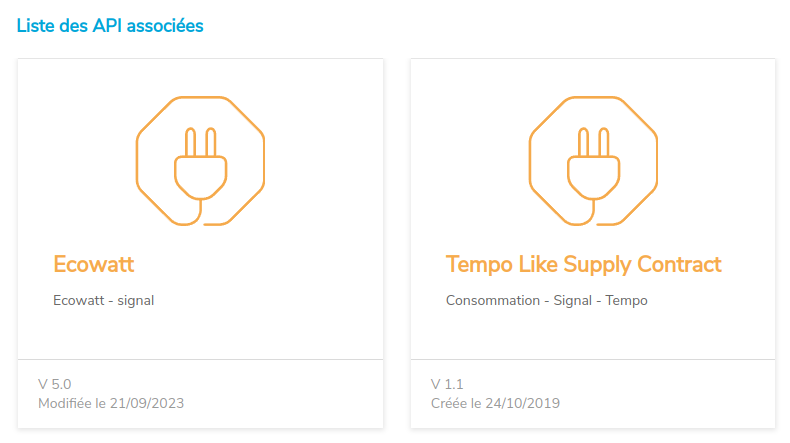 

Ces calendriers sont utilisés pour générer le calendrier de la journée et du lendemain.

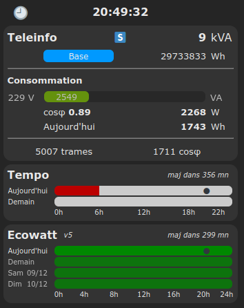

Ils sont utilisés suivant les règles suivantes :
  * si calendrier **Tempo** activé, publication de ses données
  * sinon, si calendrier **Pointe** activé, publication de ses données
  * sinon, publication des données de calendrier fournies par le compteur (**PJOURN+1**)

En complément, si le calendrier **Ecowatt** est activé, les alertes sont publiées suivant les règles suivantes :
  * alerte **orange**  = jour **blanc**
  * alerte **rouge**  = jour **rouge**

La configuration est stockée dans le fichier **rte.cfg**.

Voici la liste de toutes les commandes RTE disponibles en mode console :

    HLP: RTE server commands
    RTE global commands :
     - rte_key <key>      = set RTE base64 private key
     - rte_token          = display current token
     - rte_sandbox <0/1>  = set sandbox mode (0/1)
    Ecowatt commands :
     - eco_enable <0/1>   = enable/disable ecowatt server
     - eco_display <0/1>  = display ecowatt calendra in main page
     - eco_version <4/5>  = set ecowatt API version to use
     - eco_update         = force ecowatt update from RTE server 
     - eco_publish        = publish ecowatt data now
    Tempo commands :
     - tempo_enable <0/1>  = enable/disable tempo server
     - tempo_display <0/1> = display tempo calendra in main page
     - tempo_update        = force tempo update from RTE server
     - tempo_publish       = publish tempo data now
    Pointe commands :
     - pointe_enable <0/1> = enable/disable pointe period server
     - pointe_display <0/1 = display pointe calendra in main page
     - pointe_update       = force pointe period update from RTE server
     - pointe_publish      = publish pointe period data now

Une fois votre compte créé chez RTE et les API activées, vous devez déclarer votre **private Base64 key** en mode console :

    rte_key your_rte_key_in_base64

Il ne vous reste plus qu'à activer les modules correspondant aux API RTE : 

    tempo_enable 1
    pointe_enable 1
    eco_enable 1

Au prochain redémarrage, vous verrez dans les logs que votre ESP32 récupère un token puis les données des API activées.

    RTE: Token - abcdefghiL23OeISCK50tsGKzYD60hUt2TeESE1kBEe38x0MH0apF0y valid for 7200 seconds
    RTE: Ecowatt - Success 200
    RTE: Tempo - Update done (2/1/1)

Les données RTE sont publiées sous des sections spécifiques sous **tele/SENSOR** :

    your-device/tele/SENSOR = {"Time":"2023-12-20T07:23:39",TEMPO":{"lv":1,"hp":0,"label":"blue","icon":"🟦","yesterday":1,"today":1,"tomorrow":1}}

    your-device/tele/SENSOR = {"Time":"2023-12-20T07:36:02","POINTE":{"lv":1,"label":"blue","icon":"🟦","today":1,"tomorrow":1}}

    your-device/tele/SENSOR = {"Time":"2022-10-10T23:51:09","ECOWATT":{"dval":2,"hour":14,"now":1,"next":2,
      "day0":{"jour":"2022-10-06","dval":1,"0":1,"1":1,"2":1,"3":1,"4":1,"5":1,"6":1,...,"23":1},
      "day1":{"jour":"2022-10-07","dval":2,"0":1,"1":1,"2":2,"3":1,"4":1,"5":1,"6":1,...,"23":1},
      "day2":{"jour":"2022-10-08","dval":3,"0":1,"1":1,"2":1,"3":1,"4":1,"5":3,"6":1,...,"23":1},
      "day3":{"jour":"2022-10-09","dval":2,"0":1,"1":1,"2":1,"3":2,"4":1,"5":1,"6":1,...,"23":1}}}

## Intégration Domoticz

Ce firmware intègre une émission de messages MQTT à destination de [**Domoticz**](https://www.domoticz.com/)

La configuration des messages émis peut être réalisée en mode console :

    domo_help
    HLP: commands for Teleinfo Domoticz integration
    domo_key <num,idx> = set key num to index idx
             <0,-->  : total Wh (hc/hp) and power W for conso (base,hc/hp,ejp,bleu)
             <1,-->  : total Wh (hc/hp) and power W for conso (blanc)
             <2,-->  : total Wh (hc/hp) and power W for conso (rouge)
             <8,-->  : total Wh and power W for production
             <9,-->  : alert for current hc/hp
             <10,--> : alert fot current period color (bleu, blanc, rouge)
             <11,--> : alert for tomorrow's period color (bleu, blanc, rouge)

## Intégration Home Assistant

Ce firmware intègre la gestion du mode **auto-discovery** de [**Home Assistant**](https://www.home-assistant.io/)

Toutes les données candidates à intégration dans **Home Assistant** sont émises via MQTT en mode **retain** au boot après de réception de 5 messages complets. Cela permet d'émettre des données correspondant exactement au contrat lié au compteur raccordé.

Vous devriez avoir une découverte ressemblant à ceci :

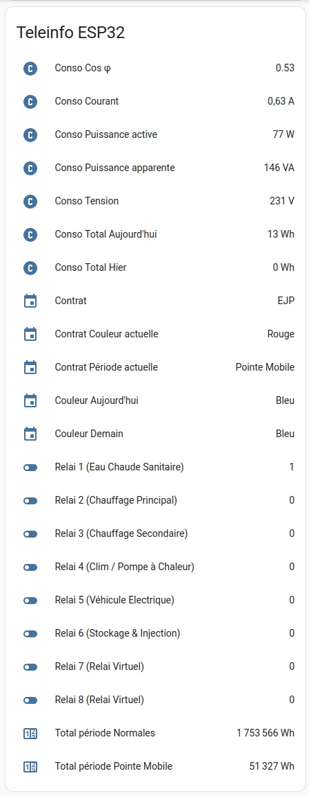

## Serveur TCP

Un serveur **TCP** est intégré à cette version de firmware.

Il permet de récupérer très simplement le flux d'information publié par le compteur. Il est à noter que ce flux envoie toutes les données recues, sans aucune correction d'erreur.

La commande **tcp_help** explique toutes les possibilités :
  * **tcp_status** : status of TCP server (running port or 0 if not running)
  * **tcp_start** [port] : start TCP server on specified port
  * **tcp_stop** : stop TCP server

Une fois le serveur activé, la réception du flux sur un PC sous Linux est un jeu d'enfant (ici sur le port 888) :

    # nc 192.168.1.10 8888
        SMAXSN-1	E220422144756	05210	W
        CCASN	E220423110000	01468	:
        CCASN-1	E220423100000	01444	Q
        UMOY1	E220423114000	235	(
        STGE	003A0001	:
        MSG1	PAS DE          MESSAGE         	<

Le serveur étant minimaliste, il ne permet qu'une seule connexion simultanée. Toute nouvelle connexion tuera la connexion précédente.

## Serveur FTP

Si vous utilisez une version de firmware avec partition LittleFS, vous avez à disposition un serveur **FTP** embarqué afin de récupérer les fichiers de manière automatisée.

La commande **ftp_help** liste toutes les possibilités :
  * **ftp_status** : status of FTP server (running port or 0 if not running)
  * **ftp_start** : start FTP server on port 21
  * **ftp_stop** : stop FTP server

Coté client FTP, vous devez utiliser les login / mot de passe suivants : **teleinfo** / **teleinfo**

Ce serveur FTP ne peut accepter qu'une seule connexion simultanée. Vous devez donc configurer votre client FTP avec une limite de type : **simultaneous connexions = 1**. Sinon, la connexion sera en erreur.

## Carte Winky

La carte [Winky](https://gricad-gitlab.univ-grenoble-alpes.fr/ferrarij/winky) développée par l'université de Grenoble avec Charles Hallard fonctionne de manière un peu particulière car elle peut être auto-alimentée par le compteur Linky à l'aide d'une super-capacité.

Elle peut être alimentée en continu par le port USB ou directement par le compteur Linky. Dans ce cas, elle se réveille régulièrement pour lire les données du compteur, les envoyer via MQTT et se rendort ensuite en mode **deep sleep** le temps de recharger la super capacité qui sera utilisée lors du prochain réveil.

Typiquement, après configuration en alimentation USB, le Winky doit être programmé en mode console afin d'activer le mode **deep sleep**. Ceci se fait à travers la console tasmota :

    deepsleeptime xxx

où **xxx** représente le nombre de secondes entre 2 réveils. Un minimum de 60 (secondes) est préconisé et il faut éviter 300 qui définit un mode de fonctionnement spécifique de Tasmota. Si la super capacité n'est pas assez rechargée lors du prochain réveil, l'ESP se rendort pour un cycle supplémentaire.

## Compilation

Si vous voulez compiler ce firmware vous-même, vous devez :
1. installer les sources **tasmota** officielles (utilisez la même version que celle déclarée en tête de cette page
2. déposez ou remplacez les fichiers de ce **repository**
3. déposez ou remplacez les fichiers du repository **tasmota/common**
4. installez les librairies **FTPClientServer** et **ArduinoJson**

Voici la liste exhaustive des fichiers concernés :

| File    |  Comment  |
| --- | --- |
| **platformio_override.ini** |    |
| partition/**esp32_partition_4M_app1800k_fs1200k.csv** | Safeboot partitioning to get 1.3Mb FS on 4Mb ESP32   |
| partition/**esp32_partition_8M_app3M_fs4M.csv** | Safeboot partitioning to get 4Mb FS on 8Mb ESP32   |
| partition/**esp32_partition_16M_app3M_fs12M.csv** | Safeboot partitioning to get 12Mb FS on 16Mb ESP32   |
| boards/**esp8266_4M2M.json** | ESP8266 4Mb boards  |
| boards/**esp8266_16M14M.json** | ESP8266 16Mb boards  |
| boards/**esp32_4M1200k.json** | ESP32 4Mb boards  |
| boards/**esp32c3_4M1200k.json** | ESP32 C3 4Mb boards  |
| boards/**esp32c6_4M1200k-safeboot.json** | ESP32 S3 16Mb boards  |
| boards/**esp32s2_4M1200k.json** | ESP32 S2 4Mb boards  |
| boards/**esp32s3_4M1200k-safeboot.json** | ESP32 S3 4Mb boards  |
| boards/**esp32s3_16M12M-safeboot.json** | ESP32 S3 16Mb boards  |
| boards/**denkyd4_8M4M-safeboot.json** | ESP32 Denky D4 8Mb boards  |
| lib/default/**ArduinoJSON** | JSON handling library used by Ecowatt server, extract content of **ArduinoJson.zip** |
| lib/default/**FTPClientServer** | FTP server library, extract content of **FTPClientServer.zip** |
| tasmota/**user_config_override.h**  |    |
| tasmota/include/**tasmota_type.h** | Redefinition of teleinfo structure |
| tasmota/tasmota_nrg_energy/**xnrg_15_teleinfo.ino** | Teleinfo energy driver  |
| tasmota/tasmota_drv_driver/**xdrv_01_9_webserver.ino** | Add compilation target in footer  |
| tasmota/tasmota_drv_energy/**xdrv_15_teleinfo.ino** | Teleinfo driver  |
| tasmota/tasmota_drv_energy/**xdrv_15_teleinfo_domoticz.ino** | Teleinfo domoticz integration  |
| tasmota/tasmota_drv_energy/**xdrv_15_teleinfo_homeassistant.ino** | Teleinfo home assistant integration  |
| tasmota/tasmota_drv_driver/**xdrv_94_ip_address.ino** | Fixed IP address Web configuration |
| tasmota/tasmota_drv_driver/**xdrv_96_ftp_server.ino** | Embedded FTP server |
| tasmota/tasmota_drv_driver/**xdrv_97_tcp_server.ino** | Embedded TCP stream server |
| tasmota/tasmota_sns_sensor/**xsns_99_timezone.ino** | Timezone Web configuration |
| tasmota/tasmota_sns_sensor/**xsns_119_rte_server.ino** | RTE Tempo, Pointe and Ecowatt data collection |
| tasmota/tasmota_sns_sensor/**xsns_124_teleinfo_histo.ino** | Teleinfo sensor to handle historisation |
| tasmota/tasmota_sns_sensor/**xsns_125_teleinfo_curve.ino** | Teleinfo sensor to handle curves |
| tasmota/tasmota_sns_sensor/**xsns_126_teleinfo_winky.ino** | Handling of Winky and deep sleep mode |

Si tout se passe bien, vous devriez pouvoir compiler votre propre build.

## Adapter

Between your Energy meter and your Tasmota device, you'll need an adapter to convert **Teleinfo** signal to **TTL serial**.

A very simple adapter diagram can be this one. Pleasee note that some Linky meters may need a resistor as low as **1k** instead of **1.5k** to avoid transmission errors.

Here is a board example using a monolithic 3.3V power supply and an ESP-01.

You need to connect your adapter output **ESP Rx** to any available serial port of your Tasmota device.

This port should be connected to your ESP UART and be declared as **TInfo RX**.

For example, you can use :
  * ESP8266 : **GPIO3 (RXD)** port
  * WT32-ETH01 : **GPIO5 (RXD)** port
  * Olimex ESP32-POE : **GPIO2** port

Finaly, in **Configure Teleinfo** you need to select your Teleinfo adapter protocol :
  * **Historique** (original white meter or green Linky in historic mode, 1200 bauds)
  * **Standard** (green Linky in standard mode, 9600 bauds)

## Main screen ##

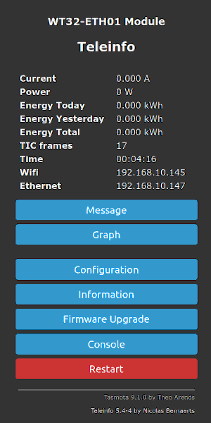
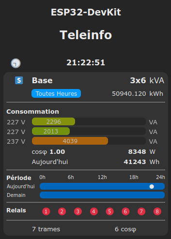

If you want to remove default Tasmota energy display, you just need to run this command in console :

    websensor3 0

## Configuration

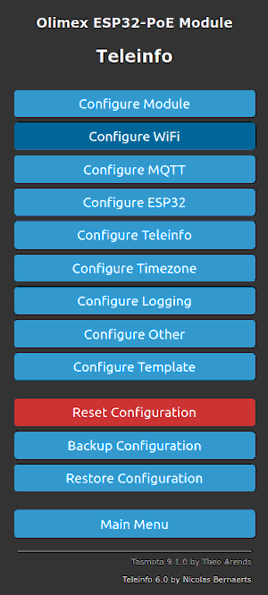

### Realtime messages ###

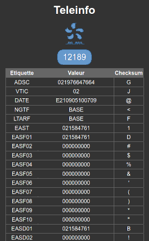 

### Graph for Power, Voltage and Cos φ ###

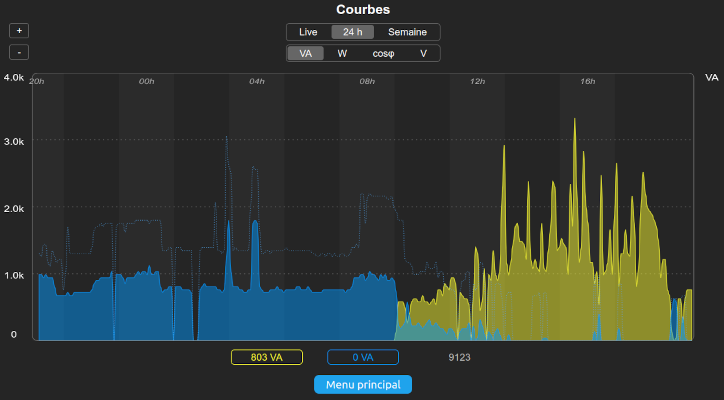
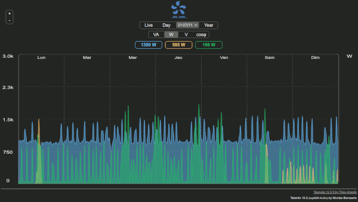
 
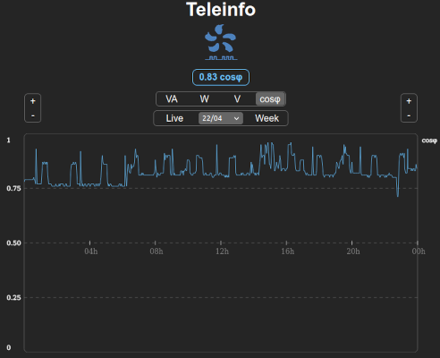 
 
### Totals Counters (kWh) ###

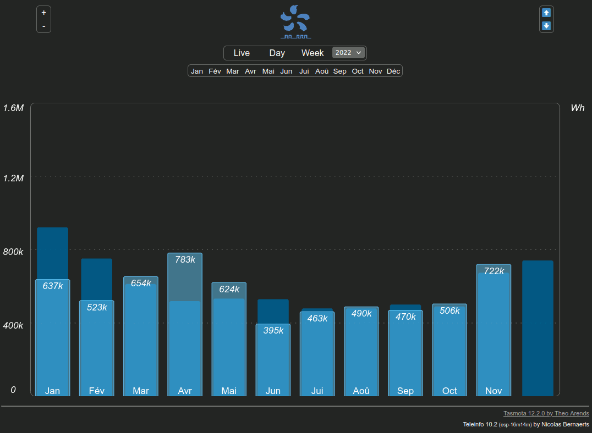
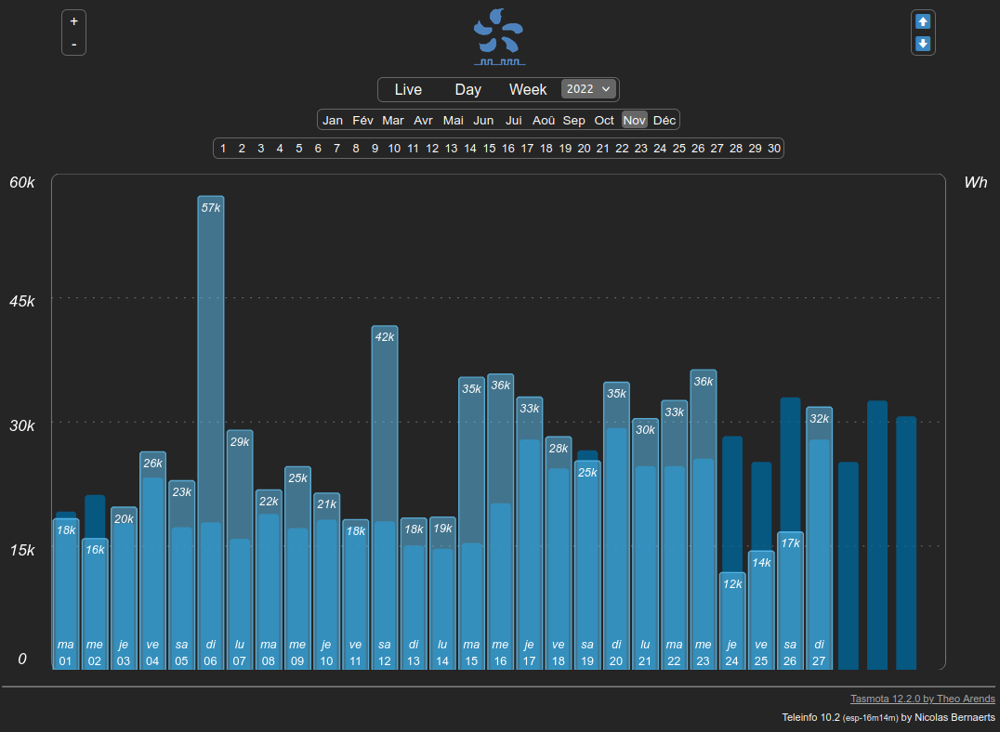
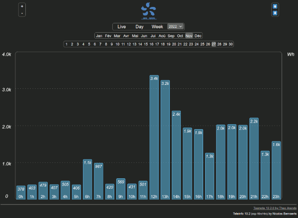
