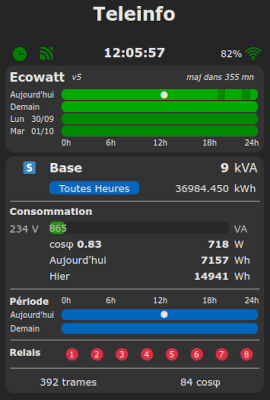
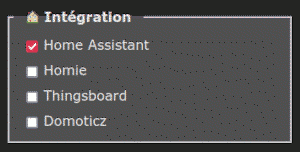
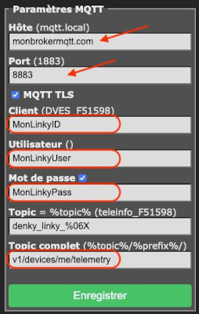
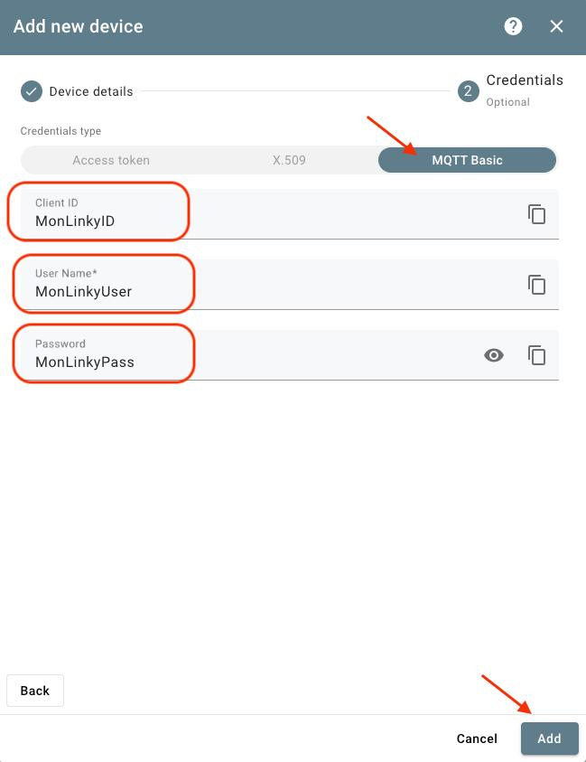

# Firmware Tasmota Teleinfo

⚠️ Ce firmware n'est pas le firmware officiel **Teleinfo** de **Tasmota** publié en 2020 par Charles Hallard. 

Pour la famille des **ESP32**, merci de faire systématiquement un premier flash en mode **Série** afin de regénérer le partitionnement et d'éviter tout dysfonctionnement. Vous pourrez alors faire toutes les mises à jour suivantes en mode **OTA**.

Le **changelog** général est disponible dans le fichier **user_config_override.h**

## Presentation

Cette évolution du firmware **Tasmota 14.1** permet de :
  * gérer le flux **Teleinfo** des compteurs français (**Linky**, **PME/PMI** et **Emeraude**)
  * gérer les compteurs en mode **Historique** et en mode **Standard**
  * gérer les compteurs en mode **Consommation** et/ou **Production**
  * calculer le **Cosφ** en quasi temps réel
  * publier les données pour **Domoticz**, **Home Assistant**, **Homie** et **Thingsboard**
  * s'abonner aux API RTE **Tempo**, **Pointe** et **Ecowatt**

Ce firmware a été développé et testé sur les compteurs suivants :
  * **Sagem Classic monophase** en TIC **Historique**
  * **Actaris A14C5** en TIC **Historique**
  * **Linky monophase** en TIC **Historique** & **Standard**
  * **Linky triphase** en TIC **Historique** & **Standard**
  * **Ace6000 triphase** en TIC **PME/PMI**
  * **Emeraude** en TIC **Emeraude 2 quadrands**

Il a été compilé et testé sur les ESP suivants :
  * **ESP8266** 1Mb, 4Mb et 16Mb
  * **ESP32** 4Mb et **ESP32 Denky D4** 8Mb
  * **ESP32C3** 4Mb
  * **ESP32C6 Winky** 4Mb (auto-alimenté par le compteur)
  * **ESP32S2** 4Mb
  * **ESP32S3** 4Mb et 16Mb

Ce firmware fournit également :
  * un serveur intégré **TCP** pour diffuser en temps réel les données reçues du compteur
  * un serveur intégré **FTP** pour récupérer les fichiers historiques
  * le suivi en temps réel des trames réçues
  * un graph en temps réel des données principales (tension, puissance et Cosφ)
  * suivi historisé de la consommation
  * suivi historisé de la production

Si votre compteur est en mode historique, la tension est forcée à 230V.

Des versions pré-compilées sont disponibles dans le répertoire [**binary**](./binary).

Le protocole **Teleinfo** est décrit dans [ce document](https://www.enedis.fr/sites/default/files/Enedis-NOI-CPT_54E.pdf)

## Fonctionnalités

Suivant le type d'ESP utilisé, toutes les fonctionnalités ne sont pas disponibles.

Voici un tableau récapitulatif des fonctionnalités par famille d'ESP :

|       Fonctionnalité        | ESP8266 1M | ESP8266 4M+ | ESP32 4M+ |
| --------------------------- | ---------- | ----------- | --------  |
| IP fixe                     |     x      |      x      |     x     |
| Calcul Cosφ                 |     x      |      x      |     x     |
| LED couleur contrat         |     x      |      x      |     x     |
| Trames temps réel           |     x      |      x      |     x     |
| Graph temps réel            |     x      |      x      |     x     |
| Graph historisé             |            |      x      |     x     |
| Consommation historisée     |            |      x      |     x     |
| Production historisée       |            |      x      |     x     |
| Serveur TCP                 |     x      |      x      |     x     |
| Serveur FTP                 |            |             |     x     |
| Intégration Home Assistant  |     x      |      x      |     x     |
| Intégration Domoticz        |     x      |      x      |     x     |
| Intégration Homie           |     x      |      x      |     x     |
| Intégration Thingsboard     |     x      |      x      |     x     |
| Intégration API RTE         |            |             |     x     |
| Taille max d'une étiquette  |    32      |    32       |    112    |
| Nombre max d'étiquettes     |    48      |    48       |    74     |

## Publication MQTT

Dans le topic **../SENSOR**, les sections suivantes peuvent être publiées 
  * **ENERGY** : section officielle de Tasmota, qui ne contien qu'un sous ensemble de données
  * **METER** : données normalisées de consommation et production en temps réel
  * **CONTRACT** : données normalisées du contrat intégrant les compteurs de périodes en Wh
  * **CAL** : calendrier heure/heure du jour et du lendemain, consolidé entre la publication compteur et les données RTE reçues (Tempo, Pointe et/ou Ecowatt)
  * **RELAY** : relais virtuels publiés par le compteur
  * **ALERT** : alertes publiées dans les messages STGE (changement Tempo / EJP, surpuissance & survoltage)

Toutes ces publications sont activables à travers la page **Configuration Teleinfo**.

|    Section   |     Clé     |  Valeur   |
| ------------ | ----------- | ----------- |
| **METER**    |    PH       | Nombre de phases (1 ou 3)  | 
|              |   PSUB      | Puissance apparente (VA) maximale par phase dans le contrat    | 
|              |   ISUB      | Courant (A) maximal par phase dans le contrat    | 
|              |   PMAX      | Puissance apparente (VA) maximale par phase intégrant le pourcentage acceptable   | 
|              |     I       | Courant global (A)    | 
|              |     P       | Puissance apparente globale (VA)   | 
|              |     W       | Puissance active globale (W)    | 
|              |     C       | Facteur de puissance (cos φ)   | 
|              |    I*x*     | Courant (A) sur la phase **_x_**   | 
|              |    U*x*     | Tension (V) sur la phase **_x_**    | 
|              |    P*x*     | Puissance apparente (VA) sur la phase **_x_**    | 
|              |    W*x*     | Puissance active (W) sur la phase **_x_**   | 
|              |    TDAY     | Puissance totale consommée aujourd'hui (Wh)   | 
|              |    YDAY     | Puissance totale consommée hier (Wh)   | 
|              |    PP       | Puissance apparente **produite** (VA) | 
|              |    PW       | Puissance active **produite** (VA) | 
|              |    PC       | Facteur de puissance (cos φ) de la **production**  | 
|              |   PTDAY     | Puissance totale **produite** aujourd'hui (Wh) | 
|              |   PYDAY     | Puissance totale **produite** hier (Wh) | 
| **CONTRACT** |   serial    | Numéro de série du compteur    | 
|              |    name     | Nom du contrat en cours        | 
|              |   period    | Nom de la periode en cours     | 
|              |    color    | Couleur de la periode en cours     | 
|              |    hour     | Type de la periode en cours     | 
|              |    tday     | Couleur du jour   | 
|              |    tmrw     | Couleur du lendemain     | 
|              |    CONSO    | Compteur global (Wh) de l'ensemble des périodes de consommation    | 
|              |  *PERIODE*  | Compteur total (Wh) de la période de consommation *PERIODE*      | 
|              |    PROD     | Compteur global (Wh) de la production    | 
| **CAL**      |    lv       | Niveau de la période actuelle (0 inconnu, 1 bleu, 2 blanc, 3 rouge)     | 
|              |    hp       | Type de la période courante (0:heure creuse, 1 heure pleine) | 
|              |  **tday**   | Section avec le niveau et le type de chaque heure du jour | 
|              |  **tmrw**   | Section avec le niveau et le type de chaque heure du lendemain | 
| **RELAY**    |    R1       | Etat du relai virtual n°1 (0:ouvert, 1:fermé)   | 
|              |    ...      |                                                 | 
|              |    R8       | Etat du relai virtual n°8 (0:ouvert, 1:fermé)   | 
|              |    P1       | Etat de la période n°1 (0:inactive, 1:active)   | 
|              |    L1       | Libellé de la période n°1   | 
|              |    ...      |                                                 | 
|              |    P9       | Etat de la période n°9 (0:inactive, 1:active)   | 
|              |    L9       | Libellé de la période n°9   | 
| **ALERT**    |    Load     | Indicateur de surconsommation (0:pas de pb, 1:sur-consommation)     | 
|              |    Volt     | Indicateur de surtension (0:pas de pb, 1:au moins 1 phase est en surtension)    | 
|              |   Preavis   | Niveau du prochain préavis (utilisé en Tempo & EJP)     | 
|              |    Label    | Libellé du prochain préavis    | 

## Commands

Ce firmware propose un certain nombre de commandes **EnergyConfig** spécifiques disponibles en mode console :

      historique   set historique mode at 1200 bauds (needs restart)
      standard     set Standard mode at 9600 bauds (needs restart)
      stats        display reception statistics
      reset        reset contract data
      error=0      display error counters on home page
      percent=100  maximum acceptable contract (%)
      
      policy=1     message policy : 0=Telemetrie seulement, 1=± 5% Evolution puissance, 2=Tous les messages TIC
      meter=1      publish METER & PROD data
      contract=1   publish CONTRACT data
      calendar=1   publish CAL data
      relay=1      publish RELAY data
      
      maxv=235     graph max voltage (V)
      maxva=3000  graph max power (VA or W)
      nbday=8      number of daily logs
      nbweek=4     number of weekly logs
      maxhour=2    graph max total per hour (Wh)
      maxday=10    graph max total per day (Wh)
      maxmonth=100 graph max total per month (Wh)

Vous pouvez passer plusieurs commandes en même temps :

      EnergyConfig percent=110 nbday=8 nbweek=12

## Partition LittleFS

Certaines variantes de ce firmware (ESP avec au moins 4Mo de ROM) utilisent une partition **LittleFS** pour stocker les données historisées qui servent à générer les graphs de suivi. Lorsque vous souhaitez utiliser cette fonctionnalité, vérifier que vous flashez bien l'ESP en mode série la première fois afin de modifier le partitionnement.

Pour les versions **LittleFS**, les graphs affichent en complément la tension et la puissances crête.

Avec une partition LittleFS, 4 familles de fichiers sont générées :
  * **teleinfo-day-nn.csv** : valeurs quotidiennes enregistrées toutes les 5 mn (**00** aujourd'hui, **01** hier, ...)
  * **teleinfo-week-nn.csv** : valeurs hebdomadaires enregistrées toutes les 30 mn (**00** semaine courante, **01** semaine précédente, ...)
  * **teleinfo-year-yyyy.csv** : Compteurs de consommation annuels
  * **production-year-yyyy.csv** : Compteur de production annuel

Chacun de ces fichiers inclue un entête.

## Calendriers RTE : Tempo, Pointe & Ecowatt

Ce firmware permet également de s'abonner aux calendriers publiés par [**RTE**](https://data.rte-france.com/) :
  * **Tempo**
  * **Pointe**
  * **Ecowatt**

Cette fonctionnalité n'est disponible que sur les **ESP32**. Vous devez tout d'abord créer un compte sur le site **RTE** [https://data.rte-france.com/] Ensuite vous devez activer l'un ou l'autre des API suivantes :
  * **Tempo**
  * **Demand Response Signal**
  * **Ecowatt**

 

Ces calendriers sont utilisés pour générer le calendrier de la journée et du lendemain.

Ils sont utilisés suivant les règles suivantes :
  * si calendrier **Tempo** activé, publication de ses données
  * sinon, si calendrier **Pointe** activé, publication de ses données
  * sinon, publication des données de calendrier fournies par le compteur (**PJOURN+1**)

En complément, si le calendrier **Ecowatt** est activé, les alertes sont publiées suivant les règles suivantes :
  * alerte **orange**  = jour **blanc**
  * alerte **rouge**  = jour **rouge**

La configuration est stockée dans le fichier **rte.cfg**.

Voici la liste de toutes les commandes RTE disponibles en mode console :

    HLP: RTE server commands
    RTE global commands :
     - rte_key <key>      = set RTE base64 private key
     - rte_token          = display current token
     - rte_sandbox <0/1>  = set sandbox mode (0/1)
    Ecowatt commands :
     - eco_enable <0/1>   = enable/disable ecowatt server
     - eco_display <0/1>  = display ecowatt calendra in main page
     - eco_version <4/5>  = set ecowatt API version to use
     - eco_update         = force ecowatt update from RTE server 
     - eco_publish        = publish ecowatt data now
    Tempo commands :
     - tempo_enable <0/1>  = enable/disable tempo server
     - tempo_display <0/1> = display tempo calendra in main page
     - tempo_update        = force tempo update from RTE server
     - tempo_publish       = publish tempo data now
    Pointe commands :
     - pointe_enable <0/1> = enable/disable pointe period server
     - pointe_display <0/1 = display pointe calendra in main page
     - pointe_update       = force pointe period update from RTE server
     - pointe_publish      = publish pointe period data now

Une fois votre compte créé chez RTE et les API activées, vous devez déclarer votre **private Base64 key** en mode console :

    rte_key your_rte_key_in_base64

Il ne vous reste plus qu'à activer les modules correspondant aux API RTE : 

    tempo_enable 1
    pointe_enable 1
    eco_enable 1

Au prochain redémarrage, vous verrez dans les logs que votre ESP32 récupère un token puis les données des API activées.

    RTE: Token - abcdefghiL23OeISCK50tsGKzYD60hUt2TeESE1kBEe38x0MH0apF0y valid for 7200 seconds
    RTE: Ecowatt - Success 200
    RTE: Tempo - Update done (2/1/1)

Les données RTE sont publiées sous des sections spécifiques sous **tele/SENSOR** :

    your-device/tele/SENSOR = {"Time":"2023-12-20T07:23:39",TEMPO":{"lv":1,"hp":0,"label":"blue","icon":"🟦","yesterday":1,"today":1,"tomorrow":1}}

    your-device/tele/SENSOR = {"Time":"2023-12-20T07:36:02","POINTE":{"lv":1,"label":"blue","icon":"🟦","today":1,"tomorrow":1}}

    your-device/tele/SENSOR = {"Time":"2022-10-10T23:51:09","ECOWATT":{"dval":2,"hour":14,"now":1,"next":2,
      "day0":{"jour":"2022-10-06","dval":1,"0":1,"1":1,"2":1,"3":1,"4":1,"5":1,"6":1,...,"23":1},
      "day1":{"jour":"2022-10-07","dval":2,"0":1,"1":1,"2":2,"3":1,"4":1,"5":1,"6":1,...,"23":1},
      "day2":{"jour":"2022-10-08","dval":3,"0":1,"1":1,"2":1,"3":1,"4":1,"5":3,"6":1,...,"23":1},
      "day3":{"jour":"2022-10-09","dval":2,"0":1,"1":1,"2":1,"3":2,"4":1,"5":1,"6":1,...,"23":1}}}

## Intégration Domotique

Il est possible de génerer des messages d'**auto-découverte** à destination de plusieurs solutions d'assistants domotiques.

Ces messages sont émis au boot après la réception de quelques messages complets depuis le compteur. Cela permet d'émettre des données correspondant exactement au contrat lié au compteur raccordé.

Avant d'activer l'intégration, il est important de sélectionner et sauvegarder les données que vous souhaitez publier :

### Intégration Domoticz

Ce firmware intègre l'auto-découverte à destination de [**Domoticz**](https://www.domoticz.com/)

La configuration des messages émis doit être réalisée en mode console :

    domo
    HLP: commands for Teleinfo Domoticz integration
    domo_enable <0> = enable/disable Domoticz integration (0/1)
    domo_key <num,idx> = set key num to index idx
             <0,index>  : index Domoticz du total Wh (hc/hp) et puissance active W pour la 1ère période du contrat (base,hc/hp,ejp,bleu)
             <1,index>  : index Domoticz du total Wh (hc/hp) et puissance active W pour la 1ère période du contrat (blanc)
             <2,index>  : index Domoticz du total Wh (hc/hp) et puissance active W pour la 1ère période du contrat (rouge)
             <8,index>  : index Domoticz du total Wh (hc/hp) et puissance active W pour la production
             <9,index>  : index Domoticz de l'alerte de publication hc/hp
             <10,index> : index Domoticz de l'alerte de publication de la couleur actuelle (bleu, blanc, rouge)
             <11,index> : index Domoticz de l'alerte de publication de la couleur du lendemain (bleu, blanc, rouge)

### Intégration Home Assistant

Ce firmware intègre l'auto-découverte à destination de [**Home Assistant**](https://www.home-assistant.io/)

Cette intégration peut être activée via le menu **Configuration / Teleinfo** ou en mode console : 

    hass 1

A chaque boot, toutes les données candidates à intégration dans **Home Assistant** sont émises via MQTT en mode **retain** .

Dans le cas particulier du Wenky, les messages d'auto-découverte ne sont pas émis au réveil s'il ne dispose pas d'une alimentation fixe via USB.

Suite à l'émission des messages d'auto-découverte, dans Home Assistant vous devriez avoir un device ressemblant à ceci :

  

### Intégration Homie

Ce firmware intègre l'auto-découverte à destination des solutions utilisant le protocole [**Homie**](https://homieiot.github.io/)

Cette intégration peut être activée via le menu **Configuration / Teleinfo** ou en mode console : 

    homie 1
 
A chaque boot, toutes les données candidates à intégration dans un client **Homie** sont émises via MQTT en mode **retain**.

Dans le cas particulier du Wenky, les messages d'auto-découverte ne sont pas émis au réveil s'il ne dispose pas d'une alimentation fixe via USB. Seuls les messages de publication des données sont émis.

### Intégration ThingsBoard

Ce firmware gère la publication des données à destination de la plateforme IoT  [**Thingsboard**](https://thingsboard.io/)

Cette intégration peut être activée via le menu **Configuration / Teleinfo** ou en mode console : 

    thingsboard 1
 
Voici le paramétrage à appliquer coté **Tasmota** et coté **Thingsboard** pour que les données soient publiées et consommées :

    

## Serveur TCP

Un serveur **TCP** est intégré à cette version de firmware.

Il permet de récupérer très simplement le flux d'information publié par le compteur. Il est à noter que ce flux envoie toutes les données recues, sans aucune correction d'erreur.

La commande **tcp_help** explique toutes les possibilités :
  * **tcp_status** : status of TCP server (running port or 0 if not running)
  * **tcp_start** [port] : start TCP server on specified port
  * **tcp_stop** : stop TCP server

Une fois le serveur activé, la réception du flux sur un PC sous Linux est un jeu d'enfant (ici sur le port 888) :

    # nc 192.168.1.10 8888
        SMAXSN-1	E220422144756	05210	W
        CCASN	E220423110000	01468	:
        CCASN-1	E220423100000	01444	Q
        UMOY1	E220423114000	235	(
        STGE	003A0001	:
        MSG1	PAS DE          MESSAGE         	<

Le serveur étant minimaliste, il ne permet qu'une seule connexion simultanée. Toute nouvelle connexion tuera la connexion précédente.

## Serveur FTP

Si vous utilisez une version de firmware avec partition LittleFS, vous avez à disposition un serveur **FTP** embarqué afin de récupérer les fichiers de manière automatisée.

Les commandes sont les suivantes :
  * **ufsftp 2** : démarrage du serveur FTP sur le port 21
  * **ufsftp 0** : arrêt du serveur FTP

Coté client FTP, vous devez utiliser les login / mot de passe suivants : **teleinfo** / **teleinfo**

Ce serveur FTP ne peut accepter qu'une seule connexion simultanée. Vous devez donc configurer votre client FTP avec une limite de type : **simultaneous connexions = 1**. Sinon, la connexion sera en erreur.

## Carte Winky

La carte [Winky](https://gricad-gitlab.univ-grenoble-alpes.fr/ferrarij/winky) développée par l'université de Grenoble avec Charles Hallard fonctionne de manière un peu particulière car elle peut être auto-alimentée par le compteur Linky à l'aide d'une super-capacité.

Elle peut être alimentée en continu par le port USB ou directement par le compteur Linky. Dans ce cas, elle se réveille régulièrement pour lire les données du compteur, les envoyer via MQTT et se rendort ensuite en mode **deep sleep** le temps de recharger la super capacité qui sera utilisée lors du prochain réveil.

Typiquement, après configuration en alimentation USB, le Winky doit être programmé en mode console afin d'activer le mode **deep sleep**. Ceci se fait à travers la console tasmota :

    deepsleeptime xxx

où **xxx** représente le nombre de secondes entre 2 réveils. Un minimum de 60 (secondes) est préconisé et il faut éviter 300 qui définit un mode de fonctionnement spécifique de Tasmota. Si la super capacité n'est pas assez rechargée lors du prochain réveil, l'ESP se rendort pour un cycle supplémentaire.

## Compilation

Si vous voulez compiler ce firmware vous-même, vous devez :
1. installer les sources **tasmota** officielles (utilisez la même version que celle déclarée en tête de cette page
2. déposez ou remplacez les fichiers de ce **repository**
3. déposez ou remplacez les fichiers du repository **tasmota/common**

Voici la liste exhaustive des fichiers concernés :

| File    |  Comment  |
| --- | --- |
| **platformio_override.ini** |    |
| partition/**esp32_partition_xxx.csv** | Specific ESP32 partitionning files   |
| boards/**espxxx.json** | ESP8266 and ESP32 boards description  |
| tasmota/**user_config_override.h**  |    |
| tasmota/include/**tasmota_type.h** | Redefinition of teleinfo structure |
| tasmota/tasmota_nrg_energy/**xnrg_15_teleinfo.ino** | Teleinfo energy driver  |
| tasmota/tasmota_drv_driver/**xdrv_01_9_webserver.ino** | Add compilation target in footer  |
| tasmota/tasmota_drv_driver/**xdrv_94_ip_option.ino** | Fixed IP address and misc options Web configuration |
| tasmota/tasmota_drv_driver/**xdrv_97_tcp_server.ino** | Embedded TCP stream server |
| tasmota/tasmota_drv_energy/**xdrv_115_teleinfo.ino** | Teleinfo driver  |
| tasmota/tasmota_drv_energy/**xdrv_116_integration_domoticz.ino** | Teleinfo domoticz integration  |
| tasmota/tasmota_drv_energy/**xdrv_117_integration_hass.ino** | Teleinfo home assistant integration  |
| tasmota/tasmota_drv_energy/**xdrv_118_integration_homie.ino** | Teleinfo homie protocol integration  |
| tasmota/tasmota_drv_energy/**xdrv_119_integration_thingsboard.ino** | Teleinfo Thingsboard protocol integration  |
| tasmota/tasmota_drv_energy/**xdrv_120_linky_relay.ino** | Management of relays according to periods and virtual relays  |
| tasmota/tasmota_sns_sensor/**xsns_99_timezone.ino** | Timezone Web configuration |
| tasmota/tasmota_sns_sensor/**xsns_119_rte_server.ino** | RTE Tempo, Pointe and Ecowatt data collection |
| tasmota/tasmota_sns_sensor/**xsns_124_teleinfo_histo.ino** | Teleinfo sensor to handle historisation |
| tasmota/tasmota_sns_sensor/**xsns_125_teleinfo_curve.ino** | Teleinfo sensor to handle curves |
| tasmota/tasmota_sns_sensor/**xsns_126_teleinfo_winky.ino** | Handling of Winky and deep sleep mode |

Si tout se passe bien, vous devriez pouvoir compiler votre propre build.

## Adapter

Between your Energy meter and your Tasmota device, you'll need an adapter to convert **Teleinfo** signal to **TTL serial**.

A very simple adapter diagram can be this one. Pleasee note that some Linky meters may need a resistor as low as **1k** instead of **1.5k** to avoid transmission errors.

Here is a board example using a monolithic 3.3V power supply and an ESP-01.

You need to connect your adapter output **ESP Rx** to any available serial port of your Tasmota device.

This port should be connected to your ESP UART and be declared as **TInfo RX**.

For example, you can use :
  * ESP8266 : **GPIO3 (RXD)** port
  * WT32-ETH01 : **GPIO5 (RXD)** port
  * Olimex ESP32-POE : **GPIO2** port

Finaly, in **Configure Teleinfo** you need to select your Teleinfo adapter protocol :
  * **Historique** (original white meter or green Linky in historic mode, 1200 bauds)
  * **Standard** (green Linky in standard mode, 9600 bauds)

## Main screen ##

If you want to remove default Tasmota energy display, you just need to run this command in console :

    websensor3 0

## Configuration

### Realtime messages ###

 

### Graph for Power, Voltage and Cos φ ###

 
 
 
### Totals Counters (kWh) ###

