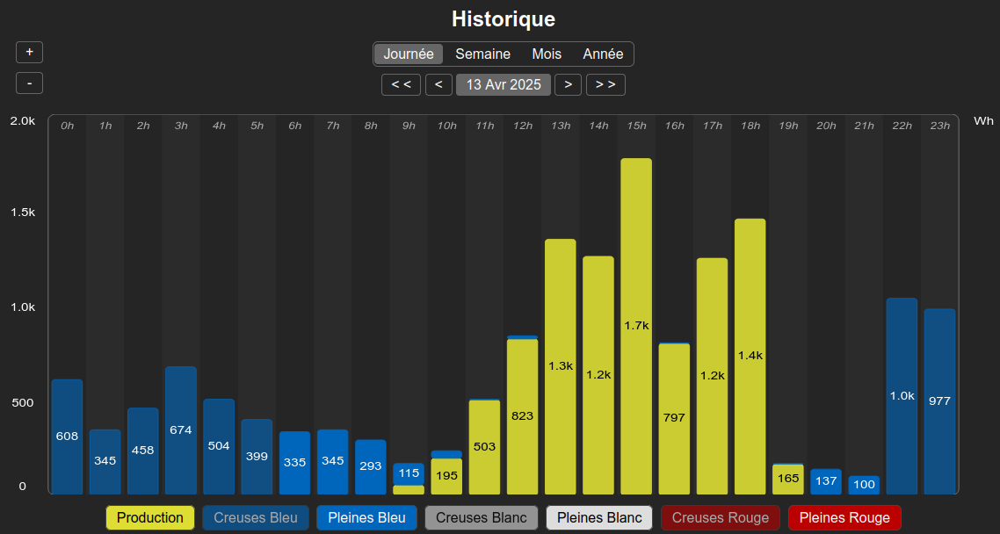
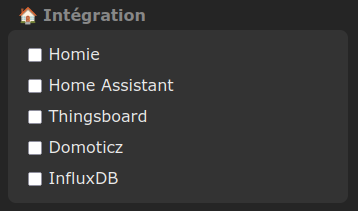

# Firmware Tasmota Teleinfo

 

⚠️ Ce firmware n'est pas le firmware officiel **Teleinfo** de **Tasmota** publié en 2020 par Charles Hallard. 

## Presentation

Cette évolution du firmware **Tasmota** permet de :
  * gérer le flux **Teleinfo** des compteurs français (**Linky**, **PME/PMI** et **Emeraude**)
  * gérer les Linky en mode **Historique** et en mode **Standard**
  * gérer les Linky en mode **Consommation** et/ou **Production**
  * calculer le **Cosφ** en quasi temps réel
  * visualiser les trames reçues en temps réel
  * fournir des graphs de suivi (VA, W, V et cosφ)
  * suivre l'historique de consommation/production
  * publier pour **Domoticz**, **Home Assistant**, **Homie** et **Thingsboard**
  * alimenter une base **InfluxDB**
  * s'abonner aux API RTE **Tempo**, **Pointe** et **Ecowatt**
  * gérer un afficheur déporté de type **Ulanzi** flashé sous **Awtrix**
  * publier le flux **TIC** sur son réseau local en **TCP**

Ce firmware a été développé et testé sur les compteurs suivants :
  * **Sagem Blanc monophase** en TIC **Historique**
  * **Actaris A14C5** en TIC **Historique** (merci à Charles Hallard pour le cadeau)
  * **Linky monophase** en TIC **Historique** & **Standard**
  * **Linky triphase** en TIC **Historique** & **Standard**
  * **Ace6000 triphase** en TIC **PME/PMI**
  * **Emeraude** en TIC **Emeraude 2 quadrands**
  * 
Il a été compilé et testé sur les ESP suivants :

  * **ESP8266** (1Mb, 4Mb et 16Mb)
  * **ESP32** (4Mb) et **ESP32 Denky D4** (8Mb)
  * **ESP32C3** (4Mb) et **Winky ESP32C6 / C3** auto-alimenté (4Mb)
  * **ESP32S2** (4Mb) et **ESP32S3** (4Mb et 16Mb)

Si votre compteur est en mode historique, la tension est forcée à 230V.

Le **changelog** général est disponible dans le fichier **user_config_override.h**

Le protocole **Teleinfo** est décrit dans [ce document](https://www.enedis.fr/sites/default/files/Enedis-NOI-CPT_54E.pdf)

## Fonctionnalités

Suivant le type d'ESP utilisé, toutes les fonctionnalités ne sont pas disponibles.

Voici un tableau récapitulatif des fonctionnalités par famille d'ESP :

|       Fonctionnalité          |   ESP8266  | ESP8266 4M+ |   ESP32   |
| ----------------------------- | ---------- | ----------- | --------  |
| IP fixe                       |     x      |      x      |     x     |
| Calcul Cos φ                  |     x      |      x      |     x     |
| LED couleur contrat           |     x      |      x      |     x     |
| Trames temps réel             |     x      |      x      |     x     |
| Graph temps réel              |    live    |    live     |     x     |
| Historique de conso/prod      |            |      x      |     x     |
| Serveur TCP                   |     x      |      x      |     x     |
| Serveur FTP                   |            |             |     x     |
| Intégration Home Assistant    |     x      |      x      |     x     |
| Intégration Domoticz          |     x      |      x      |     x     |
| Intégration Homie             |     x      |      x      |     x     |
| Intégration Thingsboard       |     x      |      x      |     x     |
| Intégration InfluxDB          |            |             |     x     |
| Prévision calendrier RTE      |            |             |     x     |
| API Production Solaire        |            |             |     x     |
| Prévision Production Solaire  |            |             |     x     |
| Pilotage afficheur Awtrix     |            |             |     x     |
| Taille max d'une étiquette    |    28      |    28       |    112    |
| Nombre max d'étiquettes       |    56      |    56       |    74     |

## Flash ##

Des versions pré-compilées pour différentes familles d'ESP sont disponibles dans le répertoire [**binary**](./binary).

Certaines variantes de ce firmware (ESP avec au moins 4Mo de ROM) utilisent une partition **LittleFS** pour stocker les données historisées qui servent à générer les graphs de suivi.

Pour la famille des **ESP8266 4M+** et **ESP32**, merci de faire systématiquement un premier flash en mode **Série** afin de regénérer le partitionnement et d'éviter tout dysfonctionnement. Vous pourrez alors faire toutes les mises à jour suivantes en mode **OTA**.

Si votre ESP est un **Denky D4**, vous pouvez flasher directement le firmware Denky D4 en mode **OTA**.

Lorsque vous flashez ce fork pour la première fois, merci de faire un **reset 6** afin de réinitialiser la configuration en ROM pour eviter tout dysfonctionnement du fait d'une ancienne configuration mal interprétée.

⚠️ La version 14.10+ intègre une refonte complète des données historiques qui gère maintenant la production et les différentes périodes (Tempo par exemple). Le nouveau format de fichier est différent du format précédent. Après mise à jour de cette version, vous ne pourrez plus visualiser les anciennes données historisées. Elles seront toujours disponible dans le fichier CSV sur le FS.

## Options de configuration

Ce firmware propose différentes options de configuration.

Merci de ne configurer que les options souhaitées afin d'avoir un système optimisé et un ESP réactif.

### Teleinfo

Ces options permettent de définir le type de compteur auquel est connecté le module.

Les anciens compteurs sont tous en mode **Historique**.

Les Linky sont principalement en mode **Historique** mais ceux utilisés avec les nouveaux contrats sont le plus souvent configurés en mode **Standard**.

Si vous modifiez cette option, le module redémarrera après sauvegarde.

### Données publiées

Ces options permettent de définir le type de données que vous souhaitez visualiser et publier via MQTT.

  * **Energie Tasmota** publie la section **ENERGY**, publication standard de tasmota. La plupart du temps vous n'avez pas besoin de cocher cette option car elle ne prend pas en compte la moitié des données publiées par un compteur Linky.
  * **Consommation & Production** publie la section **METER** et **CONTRACT**. C'est l'option que vous devriez cocher par défaut. Elle permet de publier toutes les données utiles du compteur en mode consommation, production et/ou auto-consommation. Ce sont en particulier les données utilisées par Home Assistant.
  * **Relais virtuels** publie la section **RELAY**. Elle permet de s'abonner à l'état des relais virtuels publiés par le compteur ou à des relais fonction de la période en cours du contrat. Elle est à utiliser avec des device ayant été programmés avec mon firmware **Relai**.
  * **Calendrier** publie la section **CAL**. Elle permet de publier les couleurs de contrat heure / heure pour le jour courant et le lendemain.

### Politique de publication

Cette option vous permet de définir la fréquence de publication des données.

  - **A chaque télémétrie** : Publication à chaque déclenchement de la télémétrie, configurée par **Période télémétrie**.
  - **Evolution de +-** : Publication chaque fois que la puissance varie de la valeur configurée sur l'une des phases. C'est mon option de prédilection.
  - **A chaque message reçu** : Publication à chaque trame publiée par le compteur, soit toutes les 1 à 2 secondes. Cette option n'est à utiliser que dans des cas très particuliers car elle stresse fortement l'ESP.

### Spécificités

Ces options ne sont pas nécessaires dans la plupart des cas, en particulier si vous utilisez une solution domotique.

Si vous n'en avez pas un besoin express, évitez de les sélectionner.

  * **Données temps réel** : Toutes les données liées à la consommation et la production sont publiée en complément sur un topic **LIVE/...** toutes les 3 secondes.
  * **Données Teleinfo brutes** : Les données recues depuis le compteur sont publiées telles quelles en complément sur un topic **TIC/...**.

## Commandes

Ce firmware propose un certain nombre de commandes **EnergyConfig** spécifiques disponibles en mode console :

      display=1      affichage sur page acceuil
      historique     mode historique (redémarrage)
      standard       mode standard (rédémarrage)
      noraw          pas d'emission trame TIC
      full           emission topic TIC
      skip=5         emet les topic TIC/LIVE toutes les xx trames
      live           emission topic LIVE
      reset          reset contrat et données (nécessite un redémarrage)
      automode       auto-détection du mode Linky
      calraz         remise a 0 des plages du calendrier
      calhexa=0      format des plages horaires Linky [0:decimal/1:hexa]
      percent=100    puissance maximale acceptable (% du contrat)
      trigger=0      puissance déclenchant le relai de production (W)
      policy=1       politique de publication : 0=A chaque Télémétrie, 1=Evolution de ±, 2=A chaque message reçu
      meter=1        publication sections METER & CONTRACT [0/1]
      calendar=0     publication section CAL [0/1]
      relay=0        publication section RELAY [0/1]
      period=1       affichage couleur periode en cours [0/1]
      bright=80      luminosite d'affichage LED [0..100]
      error=0        affiche les compteurs d'erreurs [0/1]
      stats          statistiques de reception

Vous pouvez passer plusieurs commandes en même temps :

      EnergyConfig percent=110 nbday=8 nbweek=12
      
## Intégration

Ces options permettent de publier les données dans un format spécifiquement attendu par un logiciel domotique ou SGBD.
Les données sont émises au boot après la réception de quelques messages complets depuis le compteur.
Cela permet d'émettre des données correspondant exactement au contrat lié au compteur raccordé.

#### Home Assistant

Toutes les données sélectionnées dans **Données publiées** sont annoncées à Home Assistant à chaque démarrage. Comme les données sont annoncées à HA, vous ne devriez plus avoir qu'à les sélectionner dans HA, qui s'abonnera et utilisera les données publiées. La publication de déclaration pour Home Asisstant est réalisée en mode **retain**. Dans le cas particulier du Winky, les messages d'auto-découverte ne sont pas émis au réveil s'il ne dispose pas d'une alimentation fixe via USB.

L'intégration Home Assistant peut être également être activée en mode console : 

    hass 1

  

#### Domoticz

Les données sont publiées dans un format spécifique reconnu nativement par Domoticz. Vous pouvez définir les données à publier en saisissant leur index. Pour chaque donnée, un tooltip explique le type de données à définir dans Domoticz.

La configuration des messages émis pour Domoticz peut également être réalisée en mode console :

    domo
    HLP: commands for Teleinfo Domoticz integration
      domo_set <0/1>     = activation de l'integration [0]
      domo_va <0/1>      = puissances en VA plutot que W [0]
      domo_key <num,idx> = set key num to index idx
        <0,index>  : Totaux conso. Bleu
        <1,index>  : Totaux conso. Blanc
        <2,index>  : Totaux conso. Rouge
        <3,index>  : Total global conso.
        <4,index>  : Courant (3 phases)
        <5,index>  : Tension (phase 1)
        <6,index>  : Tension (phase 2)
        <7,index>  : Tension (phase 3)
        <8,index>  : Total Production
        <9,index>  : Heure Pleine /Creuse
        <10,index> : Couleur du Jour
        <11,index> : Couleur du Lendemain

#### Homie

Les données sont publiées dans un format spécifique reconnu par les applications domotique compatibles [**Homie**](https://homieiot.github.io/). A chaque boot, toutes les données candidates à intégration dans un client **Homie** sont émises via MQTT en mode **retain**. Dans le cas particulier du Winky, les messages d'auto-découverte ne sont pas émis au réveil s'il ne dispose pas d'une alimentation fixe via USB.

L'intégration Homie peut également être activée en mode console : 

    homie 1

#### InfluxDB

Après avoir sélectionner l'option, vous devez définir les caractéristiques de votre serveur InfluxDB. Les données publiées devraient apparaître automatiquement sur votre instance InfluxDB.

Les données publiées sont les suivantes :
  * mode du contrat (historique:1, standard:2, PME/PMI:3, Emeraude:4, Jaune:5)
  * nombre de périodes dans le contrat et index de la période en cours
  * niveau (bleu:1, blanc:2, rouge:3) et type (hc:0, hp:1) de la période en cours
  * pour chaque phase : courant, tension, puissance apparente & puissance active et cos φ 
  * si le compteur est en mode production : puissance apparente, puissance active & cos φ 

L'activation d'InfluxDB peut également être réalisée en mode console : 

    influx 1

#### Thingsboard

Les données sont publiées dans un format spécifique reconnu nativement par la plateforme IoT  [**Thingsboard**](https://thingsboard.io/). Le paramétrage à appliquer coté **Tasmota** et coté **Thingsboard** pour que les données soient publiées et consommées est le suivant :

    

L'intégration Thingsboard peut également être activée en mode console : 

    thingsboard 1

## Calendriers RTE : Tempo, Pointe & Ecowatt

Ce firmware permet également de s'abonner aux calendriers publiés par [**RTE**](https://data.rte-france.com/) et de publier les informations via MQTT.

Il est à noter que cette fonctionnalité n'est disponible que sur les **ESP32**.

Vous devez tout d'abord créer un compte sur le site **RTE** [https://data.rte-france.com/].

Suivant le calendrier souhaité, vous devez activer les API RTE suivantes :
  * Tempo : **Tempo Like Supply Contract**
  * Pointe : **Demand Response Signal**
  * Ecowatt : **Ecowatt**

Si le calendrier **Ecowatt** est activé, les alertes sont publiées suivant les règles suivantes :
  * alerte **orange** = jour **blanc**
  * alerte **rouge**  = jour **rouge**

La configuration est stockée sur le FS dans le fichier **rte.cfg**.

Voici la liste de toutes les commandes RTE disponibles en mode console :

    HLP: RTE server commands
    RTE global commands :
     - rte_key <key>      = set RTE base64 private key
     - rte_token          = display current token
     - rte_sandbox <0/1>  = set sandbox mode (0/1)
    Ecowatt commands :
     - eco <0/1>          = enable ecowatt calendar
     - eco_display <0/1>  = display ecowatt calendar in main page
     - eco_version <4/5>  = set ecowatt API version to use
     - eco_update         = force ecowatt update from RTE server 
     - eco_publish        = publish ecowatt data now
    Tempo commands :
     - tempo <0/1>         = enable tempo calendar
     - tempo_display <0/1> = display tempo calendar in main page
     - tempo_update        = force tempo update from RTE server
     - tempo_publish       = publish tempo data now
    Pointe commands :
     - pointe <0/1>        = enable pointe calendar
     - pointe_display <0/1 = display pointe calendar in main page
     - pointe_update       = force pointe period update from RTE server
     - pointe_publish      = publish pointe period data now

Une fois votre compte créé chez RTE et les API activées, vous devez déclarer votre **private Base64 key** en mode console :

    rte_key your_rte_key_in_base64

Il ne vous reste plus qu'à activer les modules correspondant aux API RTE : 

    tempo 1
    pointe 1
    eco 1

Au prochain redémarrage, vous verrez dans les logs que votre ESP32 récupère un token puis les données des API activées.

    RTE: Token: abcdefghiL23OeISCK50tsGKzYD60hUt2TeESE1kBEe38x0MH0apF0y valid for 7200 seconds
    RTE: Ecowatt: Success 200
    RTE: Tempo: Update done (2/1/1)

Les données des calendriers RTE sont publiées sur le topic **votre-esp/tele/RTE** après chaque télépériode.

## Serveur TCP

Un serveur **TCP** est intégré à cette version de firmware.

Il permet de récupérer très simplement le flux d'information publié par le compteur. C'est très intéressant pour diagnostiquer un problème ou permettre de rejouer les données plus tard. Il est à noter que ce flux envoie toutes les données recues, sans aucune correction d'erreur. Le serveur étant minimaliste, il ne permet qu'une seule connexion simultanée. Toute nouvelle connexion tuera la connexion précédente.

La commande **tcp_** explique toutes les possibilités :

    HLP: TCP Server commands :
     - tcp_status       = server listening port, 0 if stopped (0)
     - tcp_start <port> = start server on specified port
     - tcp_stop         = stop stream
       Server allows only 1 concurrent connexion
       Any new client will kill previous one

Une fois le serveur activé, la réception du flux sur un PC sous Linux est un jeu d'enfant (ici sur le port 888). Faites **Ctrl + C** pour arrêter la commande.

    # nc 192.168.1.10 888
        SMAXSN-1	E220422144756	05210	W
        CCASN	E220423110000	01468	:
        ...

Si vous souhaitez enregistrer le flux sous Windows, l'utilitaire **ncat** devrait faire le job. Mais n'ayant plus de PC Windows depuis plusieurs années, je n'ai pas pu le tester.

## Serveur FTP

Si vous utilisez une version de firmware avec partition LittleFS, vous avez à disposition un serveur **FTP** embarqué afin de récupérer les fichiers de manière automatisée.

Les commandes sont les suivantes :
  * **ufsftp 2** : démarrage du serveur FTP sur le port 21
  * **ufsftp 0** : arrêt du serveur FTP

Coté client FTP, vous devez utiliser les login / mot de passe suivants : **teleinfo** / **teleinfo**

Ce serveur FTP ne peut accepter qu'une seule connexion simultanée. Vous devez donc configurer votre client FTP avec une limite de type : **simultaneous connexions = 1**. Sinon, la connexion sera en erreur.

## Afficheur Awtrix

Sous ESP32, ce firmware permet de gérer un affichage déporté des principales données sur un afficheur [**Ulanzi Awtrix**](https://www.ulanzi.com/products/ulanzi-pixel-smart-clock-2882?ref=28e02dxl) :
  * Puissance instantanée (consommation ou production)
  * Calendrier du jour et du lendemain (bleu, blanc ou rouge)
  * Consommation / production du jour

L'afficheur doit au préalable avoir été flashé avec le firmware Open-Source [**Awtrix3**](https://blueforcer.github.io/awtrix3/#/README).

  

Le paramétrage est réalisé en mode console via la commande **awtrix** :

    HLP: Commandes d'affichage Awtrix :
      awtrix_addr <addr> = Adresse IP du device Awtrix
      awtrix_delai [4]   = Délai entre 2 pages (min. 2s)
      awtrix_lumi  [10]  = Luminosité (1..100%), 0=auto
      awtrix_inst  [70]  = Puissance instantanée
      awtrix_cwh   [1]   = Consommation du jour
      awtrix_pwh   [1]   = Production du jour
      awtrix_cal   [0]   = Calendrier
      awtrix_pmax  [200] = Puissance produite max

## Carte Winky

La carte [Winky](https://gricad-gitlab.univ-grenoble-alpes.fr/ferrarij/winky) développée par l'université de Grenoble avec Charles Hallard fonctionne de manière un peu particulière car elle peut être auto-alimentée par le compteur Linky à l'aide d'une super-capacité.

Elle peut être alimentée en continu par le port USB ou directement par le compteur Linky. Dans ce cas, elle se réveille régulièrement pour lire les données du compteur, les envoyer via MQTT et se rendort ensuite en mode **deep sleep** le temps de recharger la super capacité qui sera utilisée lors du prochain réveil.

Typiquement, après configuration en alimentation USB, le Winky doit être programmé en mode console afin d'activer le mode **deep sleep**. Ceci se fait à travers la console tasmota :

    winky_sleep xxx

où **xxx** représente le nombre de secondes entre 2 réveils. Une valeur de **0** indique au Winky de calculer de manière dynamique l'heure de son réveil afin d'optimiser l'utilisation de la super-capacité. Sinon, en cas de valeur fixe, un minimum de 60 secondes est préconisé. Il faut éviter 300 qui définit un mode de fonctionnement spécifique de Tasmota. Si la super capacité n'est pas assez rechargée lors du prochain réveil, l'ESP se rendort pour un cycle supplémentaire.

Voici la liste des commandes de configuration spécifiques au Winky :

    winky
    HLP: gestion du winky
     - winky_display <0/1> = display data on main page [1]
     - winky_sleep <val>   = deepsleep [0]
                             0           : calcul base sur la tension
                             1.00 a 9.99 : multiplicateur duree eveil
                             10 ou +     : duree fixe (max 120)
     - winky_max <val>     = nbre de trames avant deepsleep [3]
                             2 ou + : valeurs acceptables
     - winky_start <volt>  = ension min. démarrage [4.50]
     - winky_stop <volt>   = tension min. arrêt [3.90]
     - winky_ref <farad>   = capacité super capa (F) [1.50]
     - winky_coeff         = raz coefficients ajustement des tensions
     - winky_meter         = raz tension/courant linky

## Publication MQTT

Le topic **../SENSOR** est enrichi des données suivantes :

|    Section   |     Clé     |  Valeur   |
| ------------ | ----------- | ----------- |
| **METER**    |    PH       | Nombre de phases (1 ou 3)  | 
|              |   PSUB      | Puissance apparente (VA) maximale par phase dans le contrat    | 
|              |   ISUB      | Courant (A) maximal par phase dans le contrat    | 
|              |   PMAX      | Puissance apparente (VA) maximale par phase intégrant le pourcentage acceptable   | 
|              |     I       | Courant global (A)    | 
|              |     P       | Puissance apparente globale (VA)   | 
|              |     W       | Puissance active globale (W)    | 
|              |     C       | Facteur de puissance (cos φ)   | 
|              |    I1..I3   | Courant (A) sur chaque phase  | 
|              |    U1..U3   | Tension (V) sur chaque phase    | 
|              |    P1..P3   | Puissance apparente (VA) sur chaque phase    | 
|              |    W1..W3   | Puissance active (W) sur chaque phase   | 
|              |    PP       | Puissance apparente **produite** (VA) | 
|              |    PW       | Puissance active **produite** (VA) | 
|              |    PC       | Facteur de puissance (cos φ) de la **production**  | 
|              |    TDAY     | Puissance totale consommée aujourd'hui (Wh)   | 
|              |    YDAY     | Puissance totale consommée hier (Wh)   | 
|              |   PTDAY     | Puissance totale **produite** aujourd'hui (Wh) | 
|              |   PYDAY     | Puissance totale **produite** hier (Wh) | 
| **CONTRACT** |   serial    | Numéro de série du compteur    | 
|              |    name     | Nom du contrat en cours        | 
|              |   period    | Nom de la periode en cours     | 
|              |    color    | Couleur de la periode en cours     | 
|              |    hour     | Type de la periode en cours     | 
|              |    tday     | Couleur du jour   | 
|              |    tmrw     | Couleur du lendemain     | 
|              |    CONSO    | Compteur global (Wh) de l'ensemble des périodes de consommation    | 
|              |  *PERIODE*  | Compteur total (Wh) de la période de consommation *PERIODE*      | 
|              |    PROD     | Compteur global (Wh) de la production    | 
| **CAL**      |    level    | Niveau de la période actuelle (0 inconnu, 1 bleu, 2 blanc, 3 rouge)     | 
|              |    hp       | Type de la période courante (0:heure creuse, 1 heure pleine) | 
| **RELAY**    |    V1..V8   | Etat des relais virtuels (**0/1**)   | 
|              |    C1..Cn   | Etat des relais périodes du contrat (**Etat,Niveau,Libelle**)     | 
|              |    P1       | Etat des relais de production (**0/1**) | 
|              |    W1       | Libellé de la période n°1   | 
| **ALERT**    |    Load     | Indicateur de surconsommation (0:pas de pb, 1:sur-consommation)     | 
|              |    Volt     | Indicateur de surtension (0:pas de pb, 1:au moins 1 phase est en surtension)    | 
|              |   Preavis   | Niveau du prochain préavis (utilisé en Tempo & EJP)     | 
|              |    Label    | Libellé du prochain préavis    | 

## Compilation

Si vous voulez compiler ce firmware vous-même, vous devez :
1. installer les sources **tasmota** depuis la version officielle **15.0.1** (respectez cette version)
2. déposez ou remplacez les fichiers de ce **repository**
3. déposez ou remplacez les fichiers du repository **tasmota/common**

Voici la liste exhaustive des fichiers concernés :

| File    |  Comment  |
| --- | --- |
| **platformio_override.ini** |    |
| partition/**esp32_partition_xxx.csv** | Specific ESP32 partitionning files   |
| boards/**espxxx.json** | ESP8266 and ESP32 boards description  |
| tasmota/**user_config_override.h**  | Specific configuration of Teleinfo project  |
| tasmota/include/**tasmota.h**      | Add of in-memory variables |
| tasmota/include/**tasmota_type.h** | Redefinition of teleinfo structure |
| tasmota/tasmota_drv_driver/**xdrv_01_9_webserver.ino** | Add compilation target in footer  |
| tasmota/tasmota_drv_driver/**xdrv_98_00_teleinfo_data.ino** | Data structures used by teleinfo driver and modules |
| tasmota/tasmota_drv_driver/**xdrv_98_01_teleinfo_tcp.ino** | Embedded TCP stream server |
| tasmota/tasmota_drv_driver/**xdrv_98_02_teleinfo_graph.ino** | Teleinfo live graph provider |
| tasmota/tasmota_drv_driver/**xdrv_98_03_teleinfo_histo.ino** | Teleinfo histogram provider |
| tasmota/tasmota_drv_driver/**xdrv_98_04_teleinfo_relay.ino** | Management of relays according to periods and virtual relays  |
| tasmota/tasmota_drv_driver/**xdrv_98_05_teleinfo_homie.ino** | Teleinfo Homie protocol integration  |
| tasmota/tasmota_drv_driver/**xdrv_98_06_teleinfo_domoticz.ino** | Teleinfo Domoticz integration  |
| tasmota/tasmota_drv_driver/**xdrv_98_07_teleinfo_homeassistant.ino** | Teleinfo Home Assistant integration  |
| tasmota/tasmota_drv_driver/**xdrv_98_08_teleinfo_thingsboard.ino** | Teleinfo Thingsboard protocol integration  |
| tasmota/tasmota_drv_driver/**xdrv_98_09_teleinfo_influxdb.ino** | Teleinfo InfluxDB publication module |
| tasmota/tasmota_drv_driver/**xdrv_98_10_teleinfo_rte.ino** | RTE Tempo, Pointe and Ecowatt data collection |
| tasmota/tasmota_drv_driver/**xdrv_98_11_teleinfo_awtrix.ino** | Teleinfo Awtrix display integration |
| tasmota/tasmota_drv_driver/**xdrv_98_12_teleinfo_winky.ino** | Handling of Winky module with deep sleep mode |
| tasmota/tasmota_drv_driver/**xdrv_98_20_teleinfo.ino** | Teleinfo main driver  |
| tasmota/tasmota_drv_driver/**xdrv_99_misc_option.ino** | Misc options including fixed IP address |
| tasmota/tasmota_nrg_energy/**xnrg_15_teleinfo.ino** | Teleinfo energy driver  |

Si tout se passe bien, vous devriez pouvoir compiler votre propre build.

## Adaptateur Teleinfo

Si vous me posez la question de quel adaptateur **Teleinfo** utiliser, je vous répondrais que le meilleur actuellement est le [**Denky D4**](https://www.tindie.com/products/hallard/denky-d4-esp32-tic-teleinfo-reader/) qui est très bien conçu et qui fonctionne parfaitement avec ce firmware.

Mais si vous souhaitez vraiment réaliser vous même votre adaptateur Teleinfo, voici le schéma que j'ai mis en oeuvre sur plusieurs compteurs avec des Esp8266 et des ESP32-S3 :

Concernant la résistance en tête de l'opto-coupleur, certains compteurs Linky peuvent nécessiter une résistance plus faible que la résistance classique de 1.5 kΩ. J'ai eu à descendre la résistance à **800 Ω** sur un compteur triphasé en mode standard pour éviter les erreurs de réception.

Concernant le port GPIO à utiliser coté ESP, je préconise les suivants :
  * ESP8266 : **GPIO3 (RXD)**
  * WT32-ETH01 : **GPIO5 (RXD)**
  * Olimex ESP32-POE : **GPIO2**
