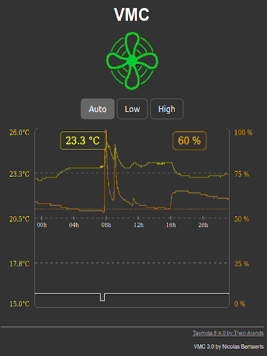

Tasmota firmware modified to control VMC
=============

This evolution of Tasmota firmware is bsed on **Tasmota v12.3.1** and has been enhanced to handle a Motor Controled Ventilator according to current humidity level.

In **Auto** mode, VMC is :
  * started as soon as humidity goes beyond a target value
  * stopped as soon as humidity goes below this target value.

Humidity sensor can either be :
  * a local SI7021 sensor
  * a local SHT30 sensor
  * a remote MQTT humidity sensor
  
You'll get some extra Web pages on the device :
  * **/control** : page to control operating mode and with a 24h humidity/temperature graph
  * **/info.json** : Main device characteristics in JSON format

MQTT result should look like that :

    {"Time":"2020-05-16T17:11:55","SI7021":{"Temperature":22.2,"Humidity":72.4},"Timezone":{"STD":{"Offset":60,"Month":10,"Week":0,"Day":1},"DST":{"Offset":120,"Month":3,"Week":0,"Day":1}},"VMC":{"Relay":1,"Mode":3,"Label":"Automatic","Temperature":22.2,"Humidity":72.4,"Target":60,"Threshold":2},"State":{"Mode":2,"Label":"High speed"},"Humidity":{"State":nan,"Topic":"","Key":""},"TempUnit":"C"}    {"VMC":{"Relay":1,"Mode":3,"Label":"Automatic","Temperature":22.2,"Humidity":71.5,"Target":60,"Threshold":2},"State":{"Mode":2,"Label":"High speed"},"Humidity":{"State":nan,"Topic":"","Key":""}}
    {"VMC":{"Relay":1,"Mode":3,"Label":"Automatic","Temperature":22.2,"Humidity":71.6,"Target":60,"Threshold":2},"State":{"Mode":2,"Label":"High speed"},"Humidity":{"State":nan,"Topic":"","Key":""}}
    {"VMC":{"Relay":1,"Mode":3,"Label":"Automatic","Temperature":22.2,"Humidity":71.7,"Target":60,"Threshold":2},"State":{"Mode":2,"Label":"High speed"},"Humidity":{"State":nan,"Topic":"","Key":""}}
    {"VMC":{"Relay":1,"Mode":3,"Label":"Automatic","Temperature":22.2,"Humidity":71.8,"Target":60,"Threshold":2},"State":{"Mode":2,"Label":"High speed"},"Humidity":{"State":nan,"Topic":"","Key":""}}

Compilation
-----------

If you want to compile this firmware version, you just need to :
1. install official tasmota sources
2. place or replace files from this repository
3. place specific files from **tasmota/common** repository

Here is where you should place different files from this repository and from **tasmota/common** :
* **platformio_override.ini**
* tasmota/**user_config_override.h**
* tasmota/include/**tasmota.h**
* tasmota/tasmota_drv_driver/**xdrv_01_webserver.ino**
* tasmota/tasmota_drv_driver/**xdrv_50_filesystem_cfg_csv.ino**
* tasmota/tasmota_drv_driver/**xdrv_94_ip_address.ino**
* tasmota/tasmota_drv_driver/**xdrv_98_vmc.ino**
* tasmota/tasmota_sns_sensor/**xsns_121_vmc.ino**
* tasmota/tasmota_sns_sensor/**xsns_120_timezone.ino**
* tasmota/tasmota_sns_sensor/**xsns_99_generic_sensor.ino**

If everything goes fine, you should be able to compile your own build.

   
